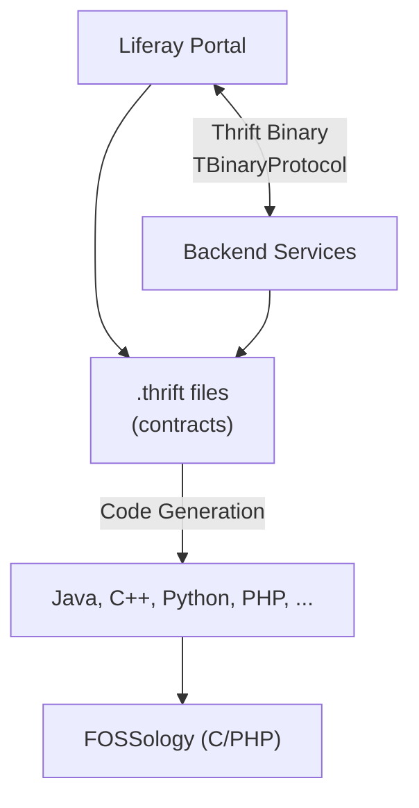

# Decision Analysis and Resolution: SW360 Internal RPC Framework

**Created by:** SW360 Architecture Team  
**Original Decision:** 2014  
**Reformatted:** April 2026  
**Status:** Accepted  
**Estimated read time:** 10 minutes

---

## Table of Contents

1. [Background](#background)
2. [Goal](#goal)
3. [Key Principles](#key-principles)
4. [Key Inputs, Assumptions and Restrictions](#key-inputs-assumptions-and-restrictions)
5. [Options Analysis](#options-analysis)
   - [Option 1 - REST/JSON](#option-1---restjson)
   - [Option 2 - SOAP/XML](#option-2---soapxml)
   - [Option 3 - Apache Thrift](#option-3---apache-thrift)
   - [Option 4 - gRPC/Protocol Buffers](#option-4---grpcprotocol-buffers)
6. [Criteria for Making a Decision](#criteria-for-making-a-decision)
7. [Final Decision](#final-decision)
8. [Contributors](#contributors)
9. [Discussion & Brainstorming](#discussion--brainstorming)

---

## Background

SW360 was designed as a multi-tier application for open source license compliance management with:
- A web portal (Liferay) as the frontend
- Backend services handling business logic
- A document database (CouchDB) for persistence

**FOSSology Integration Challenge:** A critical requirement was integration with FOSSology, a license scanning tool. At the time (2014), neither FOSSology nor SW360 had REST APIs. The need arose for a communication protocol that could bridge the Java-based SW360 and the predominantly C/PHP-based FOSSology.

**Internal Communication Needs:** The system also needed an efficient, reliable communication protocol between the web layer and backend services for internal operations.

**Why This Decision Matters Now:** This decision affects:
- All internal service-to-service communication
- External tool integrations
- Developer experience and onboarding
- System performance and maintainability

---

## Goal

The goal of this decision analysis is to:
1. Select an internal RPC framework for SW360 that supports efficient service communication
2. Enable integration with external tools like FOSSology
3. Provide strong interface contracts to prevent service drift
4. Support potential polyglot implementations in the future
5. Document the rationale for future team members

---

## Key Principles

| # | Principle | Description |
|---|-----------|-------------|
| 1 | **Efficiency First** | Internal communication should minimize overhead |
| 2 | **Strong Contracts** | Interface definitions should be explicit and versioned |
| 3 | **Cross-language Support** | Must support Java, C++, Python, PHP for FOSSology integration |
| 4 | **Developer Productivity** | Code generation preferred over manual serialization |
| 5 | **Maturity** | Framework must be production-ready and well-supported |

---

## Key Inputs, Assumptions and Restrictions

| Type | Description |
|------|-------------|
| **Input** | FOSSology is written in C/PHP and has no REST API (2014) |
| **Input** | SW360 backend is Java-based with Spring framework |
| **Input** | Complex nested data structures (components, releases, licenses) must be exchanged |
| **Assumption** | Internal communication will remain on same network/machine |
| **Assumption** | External clients will need a separate REST API layer |
| **Restriction** | Must integrate with Liferay portal framework |
| **Restriction** | Budget does not allow commercial RPC solutions |

---

## Options Analysis

### Option 1 - REST/JSON

#### Summary
Use RESTful HTTP APIs with JSON serialization for all internal and external communication. This is the most common approach for web services and offers broad tooling support.

#### Conceptual View


#### Impact / Changes Required
- Implement REST controllers for all backend services
- Define JSON schemas for all data transfer objects
- Manual serialization/deserialization code
- FOSSology would need REST API development (not available in 2014)

#### SWOT Analysis

| Category | Analysis |
|----------|----------|
| **Strengths** | 1. Universal understanding - every developer knows REST<br/>2. Human-readable JSON for debugging<br/>3. Broad tooling support (Postman, curl, etc.)<br/>4. Stateless by design<br/>5. Works through firewalls easily |
| **Weaknesses** | 1. Verbose JSON increases payload size<br/>2. No native schema/contract enforcement<br/>3. Manual serialization code required<br/>4. HTTP overhead for internal calls<br/>5. Complex nested structures require careful design |
| **Opportunities** | 1. Could serve as both internal and external API<br/>2. Easy to add caching layers<br/>3. OpenAPI/Swagger for documentation |
| **Threats** | 1. Schema drift between services without strict governance<br/>2. Performance issues with large payloads<br/>3. FOSSology has no REST API (2014) - integration blocked |

---

### Option 2 - SOAP/XML

#### Summary
Use SOAP (Simple Object Access Protocol) with XML serialization. This was the enterprise standard for web services, offering strong typing through WSDL contracts.

#### Conceptual View


#### Impact / Changes Required
- Define WSDL contracts for all services
- Generate Java stubs from WSDL
- Heavy XML processing infrastructure
- FOSSology integration would require SOAP support

#### SWOT Analysis

| Category | Analysis |
|----------|----------|
| **Strengths** | 1. Strong typing through WSDL<br/>2. Enterprise standard with proven track record<br/>3. Built-in error handling (SOAP faults)<br/>4. WS-Security for authentication |
| **Weaknesses** | 1. Extremely verbose XML payloads<br/>2. High processing overhead<br/>3. Complex tooling and configuration<br/>4. Poor support in non-Java languages<br/>5. Heavy memory footprint |
| **Opportunities** | 1. Enterprise integration patterns available |
| **Threats** | 1. Industry moving away from SOAP (2014)<br/>2. Limited C/PHP support for FOSSology<br/>3. Developer resistance - seen as "legacy"<br/>4. Maintenance overhead for WSDL files |

---

### Option 3 - Apache Thrift

#### Summary
Use Apache Thrift, a binary RPC framework with Interface Definition Language (IDL). Thrift generates client/server code for multiple languages from a single interface definition.

#### Conceptual View


#### Impact / Changes Required
- Define Thrift IDL files for all data structures and services
- Add Thrift compiler to build process
- Generate Java handlers for backend services
- FOSSology can use generated C/PHP code directly

#### SWOT Analysis

| Category | Analysis |
|----------|----------|
| **Strengths** | 1. Efficient binary protocol - compact payloads<br/>2. Strong IDL contracts - compile-time checking<br/>3. Excellent cross-language support (Java, C++, Python, PHP)<br/>4. Code generation eliminates serialization boilerplate<br/>5. Native support for complex types (maps, sets, nested structs)<br/>6. Optional fields for backward compatibility<br/>7. Battle-tested at Facebook scale |
| **Weaknesses** | 1. Learning curve for Thrift concepts<br/>2. Requires Thrift compiler in build process<br/>3. Binary protocol harder to debug than JSON<br/>4. Limited IDE support for .thrift files<br/>5. Cannot expose directly to external clients (need REST wrapper) |
| **Opportunities** | 1. Enables FOSSology integration immediately<br/>2. IDL files serve as living documentation<br/>3. Can add new languages in future without rewriting<br/>4. Performance optimization path available |
| **Threats** | 1. Smaller community than REST<br/>2. gRPC emerging as competitor<br/>3. Team must maintain Thrift expertise<br/>4. Version management across services |

---

### Option 4 - gRPC/Protocol Buffers

#### Summary
Use Google's gRPC framework with Protocol Buffers for serialization. Similar to Thrift but newer, with HTTP/2 transport and strong Google backing.

#### Conceptual View


#### Impact / Changes Required
- Define .proto files for all services
- Add protoc compiler to build process
- Generate Java/C++ stubs
- Requires HTTP/2 support throughout

#### SWOT Analysis

| Category | Analysis |
|----------|----------|
| **Strengths** | 1. Modern HTTP/2 transport with streaming<br/>2. Efficient Protocol Buffer serialization<br/>3. Strong Google backing and community<br/>4. Good tooling and documentation |
| **Weaknesses** | 1. **Immature in 2014** - gRPC 1.0 released in 2016<br/>2. Limited language support in 2014<br/>3. HTTP/2 not widely supported in 2014<br/>4. No PHP support initially (critical for FOSSology) |
| **Opportunities** | 1. Growing ecosystem<br/>2. Cloud-native alignment |
| **Threats** | 1. **Production-ready version not available (2014)**<br/>2. PHP support timeline uncertain<br/>3. Breaking changes expected before 1.0<br/>4. FOSSology integration blocked |

---

## Criteria for Making a Decision

### T-Shirt Sizing Scale

| T-Shirt Size | Numeric Value | Meaning |
|--------------|---------------|---------|
| XS | 1.0 | Worst for this aspect |
| S | 2.5 | Poor |
| S-M | 3.75 | Below Average |
| M | 5.0 | Average |
| M-L | 6.25 | Above Average |
| L | 7.5 | Good |
| L-XL | 8.75 | Very Good |
| XL | 10.0 | Best for this aspect |

### Weighted Evaluation Matrix

| Criteria | Description | Weight | REST/JSON | | SOAP/XML | | Thrift | | gRPC | |
|----------|-------------|--------|-----------|-------|----------|-------|--------|-------|------|-------|
| | | | Rating | Score | Rating | Score | Rating | Score | Rating | Score |
| **FOSSology Integration** | Must support C/PHP languages for FOSSology | 10 | XS | 10.0 | XS | 10.0 | XL | 100.0 | XS | 10.0 |
| **Performance** | Binary efficiency, low overhead for internal calls | 8 | M | 40.0 | S | 20.0 | L-XL | 70.0 | L-XL | 70.0 |
| **Type Safety** | Compile-time contract enforcement | 8 | S | 20.0 | L | 60.0 | L-XL | 70.0 | L-XL | 70.0 |
| **Complex Data Structures** | Support for nested objects, maps, collections | 7 | M | 35.0 | M-L | 43.75 | XL | 70.0 | L-XL | 61.25 |
| **Developer Experience** | Learning curve, debugging, tooling | 7 | L-XL | 61.25 | S-M | 26.25 | M-L | 43.75 | M | 35.0 |
| **Code Generation** | Automatic stub generation reduces boilerplate | 6 | S | 15.0 | M-L | 37.5 | XL | 60.0 | XL | 60.0 |
| **Production Readiness** | Mature, battle-tested, stable (as of 2014) | 9 | XL | 90.0 | L | 67.5 | L-XL | 78.75 | XS | 9.0 |
| **Community & Support** | Documentation, community help, longevity | 6 | XL | 60.0 | M | 30.0 | L | 45.0 | S | 15.0 |
| **Cross-Language Support** | Java, C++, Python, PHP coverage | 8 | L | 60.0 | S-M | 30.0 | XL | 80.0 | S-M | 30.0 |
| **Backward Compatibility** | Adding fields without breaking clients | 6 | M | 30.0 | M | 30.0 | L-XL | 52.5 | L-XL | 52.5 |
| | | **TOTAL** | | **421.25** | | **355.0** | | **670.0** | | **412.75** |

### Score Summary

| Rank | Option | Total Score | Recommendation |
|------|--------|-------------|----------------|
| 🥇 1 | **Apache Thrift** | **670.0** | ✅ **SELECTED** |
| 🥈 2 | REST/JSON | 421.25 | External API layer |
| 🥉 3 | gRPC | 412.75 | Not production-ready (2014) |
| 4 | SOAP/XML | 355.0 | ❌ Rejected |

---

## Final Decision

### Selected Option: **Apache Thrift**

### Rationale

Apache Thrift was selected as the internal RPC framework for SW360 based on:

1. **Highest Weighted Score (670.0)** - Significantly outperformed alternatives across all criteria

2. **Critical FOSSology Integration** - The highest-weighted criterion (10). Thrift's native C/PHP support was the only option enabling FOSSology integration without requiring FOSSology to implement a new API

3. **Superior Type Safety** - Thrift IDL provides compile-time guarantees that prevent service interface drift:
   ```thrift
   service ComponentService {
       Component getComponentById(1: string id, 2: User user) 
           throws (1: SW360Exception exp);
   }
   ```

4. **Complex Data Structure Support** - Native handling of nested structures, optional fields, and collections essential for SW360's data model

5. **Production Readiness** - Battle-tested at Facebook scale, unlike gRPC which wasn't released until 2016

### Implementation Notes

**Thrift Files Location:**
```
libraries/datahandler/src/main/thrift/
├── sw360.thrift          # Common types, enums
├── components.thrift     # Component, Release
├── projects.thrift       # Project, ClearingRequest
├── licenses.thrift       # License, Obligation
├── users.thrift          # User, UserGroup
└── ...
```

**Service Pattern:**
```java
// Handler implements Thrift interface
public class ComponentHandler implements ComponentService.Iface {
    @Override
    public Component getComponentById(String id, User user) 
            throws SW360Exception {
        // Implementation
    }
}
```

**External API:** REST/JSON layer to be added for external client access (cannot expose Thrift directly)

### Review Triggers

This decision should be revisited if:
- [ ] FOSSology deprecates Thrift support
- [ ] gRPC becomes the industry standard with full PHP support
- [ ] Major Thrift vulnerabilities are discovered
- [ ] Team expertise in Thrift becomes unsustainable

---

## Contributors

| Name | Role | Contribution |
|------|------|--------------|
| SW360 Architecture Team | Decision Makers | Requirements analysis, criteria weighting |
| FOSSology Team | Stakeholder | Integration requirements |
| Development Team | Implementers | Feasibility assessment |

---

## Discussion & Brainstorming

### Architecture Team - 2014
The key differentiator is FOSSology integration. Without Thrift, we would need to wait for FOSSology to implement REST APIs, which is outside our control and timeline.

### Development Team - 2014
Concern: Learning curve for Thrift IDL. Mitigation: Create internal documentation and code examples. The code generation actually reduces overall development effort.

### Operations - 2014
Binary protocol harder to debug. Recommendation: Implement detailed logging at service boundaries and consider JSON protocol for development environments.

---

## Consequences Summary

### Positive
- ✅ Strong typing with compile-time checking of service interfaces
- ✅ Efficient binary protocol for large payloads
- ✅ Clear contracts through IDL files as documentation
- ✅ Backward compatibility through optional fields
- ✅ Consistent data model across all layers
- ✅ FOSSology integration enabled immediately

### Negative
- ⚠️ Learning curve for developers new to Thrift
- ⚠️ Build complexity with Thrift compiler dependency
- ⚠️ Binary protocol harder to inspect than JSON
- ⚠️ REST API needed for external client integration

### Technical Debt Created
- External REST API layer needed for non-Thrift clients
- Thrift compiler must be maintained in CI/CD pipeline

---

## Revision History

| Version | Date | Author | Changes |
|---------|------|--------|---------|
| 1.0 | 2014 | Architecture Team | Initial decision |
| 2.0 | April 2026 | Bibhuti Bhusan Dash | Reformatted to DAR/SWOT template |
