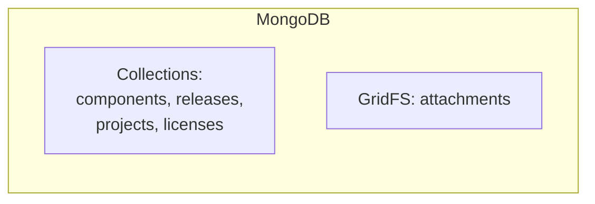
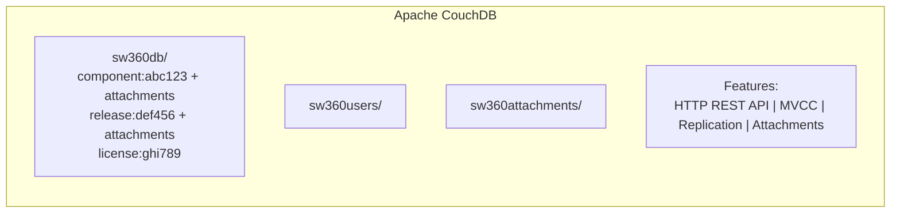
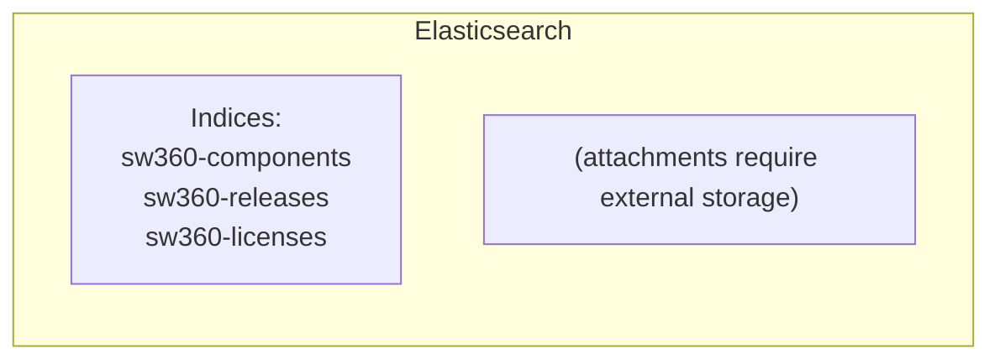

# Decision Analysis and Resolution: SW360 Primary Database

**Created by:** SW360 Architecture Team  
**Original Decision:** 2014  
**Reformatted:** April 2026  
**Status:** Accepted  
**Estimated read time:** 12 minutes

---

## Table of Contents

1. [Background](#background)
2. [Goal](#goal)
3. [Key Principles](#key-principles)
4. [Key Inputs, Assumptions and Restrictions](#key-inputs-assumptions-and-restrictions)
5. [Options Analysis](#options-analysis)
   - [Option 1 - PostgreSQL/MySQL](#option-1---postgresqlmysql)
   - [Option 2 - MongoDB](#option-2---mongodb)
   - [Option 3 - Apache CouchDB](#option-3---apache-couchdb)
   - [Option 4 - Elasticsearch](#option-4---elasticsearch)
6. [Criteria for Making a Decision](#criteria-for-making-a-decision)
7. [Final Decision](#final-decision)
8. [Contributors](#contributors)
9. [Evolution & Updates](#evolution--updates)

---

## Background

SW360 manages software components, releases, projects, and licenses for open source license compliance. The data model is characterized by:

- **Complex, evolving structures**: Components have different fields than licenses; new fields are frequently added
- **Binary attachments**: Source code archives, clearing reports, license texts
- **Full-text search requirements**: Search across all document fields
- **Enterprise deployments**: Need horizontal scaling and high availability
- **Replication needs**: Disaster recovery and geographic distribution

**Why This Decision Matters:** The database choice fundamentally affects every aspect of SW360—from development productivity to operational complexity to feature capabilities.

---

## Goal

The goal of this decision analysis is to:
1. Select a primary database that supports SW360's document-centric data model
2. Enable storage of binary attachments alongside metadata
3. Provide full-text search capabilities
4. Support enterprise deployment requirements (HA, replication, scaling)
5. Minimize operational complexity

---

## Key Principles

| # | Principle | Description |
|---|-----------|-------------|
| 1 | **Schema Flexibility** | Support varying document structures without migrations |
| 2 | **Attachment Co-location** | Store binaries with their metadata |
| 3 | **Simple Integration** | Avoid complex drivers and ORM layers |
| 4 | **Operational Simplicity** | Easy backup, replication, and disaster recovery |
| 5 | **Production Readiness** | Battle-tested with enterprise deployments |

---

## Key Inputs, Assumptions and Restrictions

| Type | Description |
|------|-------------|
| **Input** | SW360 data model has ~20 document types with varying schemas |
| **Input** | Attachments range from KB to hundreds of MB (source archives) |
| **Input** | Full-text search is critical for license compliance workflows |
| **Assumption** | Write volume is moderate; read-heavy workload |
| **Assumption** | Strong consistency within a document is sufficient |
| **Restriction** | Must be open source with enterprise adoption |
| **Restriction** | Operations team prefers HTTP-based APIs for monitoring |

---

## Options Analysis

### Option 1 - PostgreSQL/MySQL

#### Summary
Use a traditional relational database with JSONB columns for flexible schema support. This leverages established SQL expertise while adding semi-structured data capabilities.

#### Conceptual View
```
┌─────────────────────────────────────────────┐
│               PostgreSQL                     │
├─────────────────────────────────────────────┤
│  components (id, type, data JSONB)          │
│  releases (id, component_id, data JSONB)    │
│  attachments (id, blob BYTEA, metadata)     │
│  ... foreign keys, indexes ...              │
└─────────────────────────────────────────────┘
```

#### Impact / Changes Required
- Design hybrid schema with JSONB for flexible fields
- Implement separate attachment storage (filesystem or blob)
- Add full-text search via PostgreSQL FTS or external Elasticsearch
- Build custom replication for HA

#### SWOT Analysis

| Category | Analysis |
|----------|----------|
| **Strengths** | 1. ACID transactions guarantee consistency<br/>2. Mature ecosystem, well-understood by operations<br/>3. Powerful query capabilities (joins, aggregations)<br/>4. PostgreSQL JSONB supports semi-structured data<br/>5. Large community and tooling |
| **Weaknesses** | 1. Schema changes require migrations<br/>2. Attachment storage requires separate solution<br/>3. Horizontal scaling more complex (sharding)<br/>4. ORM layers add complexity for nested documents<br/>5. Master-slave replication, not multi-master |
| **Opportunities** | 1. Can add extensions (PostGIS, pg_trgm)<br/>2. Foreign data wrappers for integration |
| **Threats** | 1. Schema evolution friction slows development<br/>2. Attachment handling creates operational complexity<br/>3. Full-text search requires additional setup |

---

### Option 2 - MongoDB

#### Summary
Use MongoDB as a document-oriented database with native JSON storage, flexible schemas, and GridFS for large file storage.

#### Conceptual View


#### Impact / Changes Required
- Design document collections with embedded relationships
- Configure GridFS for attachment storage
- Set up replica sets for high availability
- Integrate MongoDB text search

#### SWOT Analysis

| Category | Analysis |
|----------|----------|
| **Strengths** | 1. Native JSON document storage<br/>2. Flexible schema with embedded documents<br/>3. GridFS for large file storage<br/>4. Built-in text search<br/>5. Horizontal scaling via sharding |
| **Weaknesses** | 1. Less mature than PostgreSQL (in 2014)<br/>2. GridFS separates files from documents<br/>3. No multi-document transactions (2014)<br/>4. Memory-mapped storage can consume RAM<br/>5. Requires MongoDB driver expertise |
| **Opportunities** | 1. Growing ecosystem and community<br/>2. Cloud-hosted options (Atlas) |
| **Threats** | 1. License changes (SSPL) may affect deployment<br/>2. Operational complexity for large deployments<br/>3. Vendor lock-in concerns |

---

### Option 3 - Apache CouchDB

#### Summary
Use Apache CouchDB, a document-oriented database with HTTP API, native attachment storage, and built-in replication capabilities.

#### Conceptual View


#### Impact / Changes Required
- Design documents by type with type discriminator field
- Attach binaries directly to documents
- Configure views (MapReduce) for queries
- Set up replication for disaster recovery

#### SWOT Analysis

| Category | Analysis |
|----------|----------|
| **Strengths** | 1. Native HTTP REST API—debug with curl/browser<br/>2. Attachments stored directly on documents<br/>3. Built-in master-master replication<br/>4. MVCC prevents concurrent update conflicts<br/>5. Flexible schema—no migrations needed<br/>6. Apache license, truly open source |
| **Weaknesses** | 1. No SQL joins—manual denormalization needed<br/>2. MapReduce views require JavaScript knowledge<br/>3. Views can consume significant memory<br/>4. Eventual consistency model<br/>5. Smaller community than PostgreSQL/MongoDB |
| **Opportunities** | 1. CouchDB-Lucene for full-text search<br/>2. Nouveau (CouchDB 3.4+) integrates search natively<br/>3. PouchDB for offline-first applications<br/>4. IBM Cloudant provides managed service |
| **Threats** | 1. Limited adoption compared to alternatives<br/>2. Developer mindset shift from SQL<br/>3. View performance tuning can be complex |

---

### Option 4 - Elasticsearch

#### Summary
Use Elasticsearch as the primary database, leveraging its distributed search and document storage capabilities.

#### Conceptual View


#### Impact / Changes Required
- Design indices with mappings
- Implement external attachment storage
- Handle document versioning manually
- Manage cluster operations

#### SWOT Analysis

| Category | Analysis |
|----------|----------|
| **Strengths** | 1. Exceptional search capabilities<br/>2. Distributed by design<br/>3. Powerful aggregations<br/>4. Near real-time indexing |
| **Weaknesses** | 1. Not designed as primary database<br/>2. No native attachment storage<br/>3. Document updates are expensive (re-index)<br/>4. No transactions or constraints<br/>5. Cluster management complexity |
| **Opportunities** | 1. Combined search and storage |
| **Threats** | 1. License changes (Elastic License)<br/>2. Data loss risks without careful configuration<br/>3. Resource-intensive for primary storage<br/>4. Not battle-tested as primary DB |

---

## Criteria for Making a Decision

### T-Shirt Sizing Scale

| T-Shirt Size | Numeric Value | Meaning |
|--------------|---------------|---------|
| XS | 1.0 | Worst for this aspect |
| S | 2.5 | Poor |
| S-M | 3.75 | Below Average |
| M | 5.0 | Average |
| M-L | 6.25 | Above Average |
| L | 7.5 | Good |
| L-XL | 8.75 | Very Good |
| XL | 10.0 | Best for this aspect |

### Weighted Evaluation Matrix

| Criteria | Description | Weight | PostgreSQL | | MongoDB | | CouchDB | | Elasticsearch | |
|----------|-------------|--------|------------|-------|---------|-------|---------|-------|---------------|-------|
| | | | Rating | Score | Rating | Score | Rating | Score | Rating | Score |
| **Schema Flexibility** | Add fields without migrations | 9 | M | 45.0 | L-XL | 78.75 | XL | 90.0 | L | 67.5 |
| **Attachment Storage** | Store binaries with documents | 9 | S | 22.5 | M | 45.0 | XL | 90.0 | XS | 9.0 |
| **Replication/HA** | Built-in disaster recovery | 8 | M-L | 50.0 | L | 60.0 | XL | 80.0 | L | 60.0 |
| **Query Flexibility** | Complex queries, aggregations | 7 | XL | 70.0 | L | 52.5 | M | 35.0 | L-XL | 61.25 |
| **Full-Text Search** | Search across all content | 7 | M | 35.0 | M-L | 43.75 | M-L | 43.75 | XL | 70.0 |
| **HTTP API** | Debug with curl/browser | 6 | S | 15.0 | S-M | 22.5 | XL | 60.0 | L | 45.0 |
| **Production Readiness** | Enterprise deployments | 8 | XL | 80.0 | M-L | 50.0 | L | 60.0 | M-L | 50.0 |
| **MVCC/Conflict Handling** | Concurrent update safety | 6 | L | 45.0 | M | 30.0 | XL | 60.0 | M | 30.0 |
| **Developer Experience** | Learning curve, debugging | 7 | L-XL | 61.25 | L | 52.5 | L | 52.5 | M-L | 43.75 |
| **Open Source License** | True open source, no lock-in | 6 | XL | 60.0 | M-L | 37.5 | XL | 60.0 | M | 30.0 |
| **Operational Simplicity** | Backup, monitoring, tuning | 7 | L | 52.5 | M-L | 43.75 | L | 52.5 | M | 35.0 |
| | | **TOTAL** | | **536.25** | | **516.25** | | **683.75** | | **501.5** |

### Score Summary

| Rank | Option | Total Score | Recommendation |
|------|--------|-------------|----------------|
| 🥇 1 | **Apache CouchDB** | **683.75** | ✅ **SELECTED** |
| 🥈 2 | PostgreSQL | 536.25 | Good alternative for SQL teams |
| 🥉 3 | MongoDB | 516.25 | Close competitor |
| 4 | Elasticsearch | 501.5 | ❌ Not suited as primary DB |

---

## Final Decision

### Selected Option: **Apache CouchDB**

### Rationale

Apache CouchDB was selected as the primary database for SW360 based on:

1. **Highest Weighted Score (683.75)** - Clear winner across combined criteria

2. **Attachment Storage (XL)** - Only option with native document-level attachment storage:
   ```json
   {
     "_id": "release:abc123",
     "_attachments": {
       "source.tar.gz": { "content_type": "application/gzip", "length": 15728640 },
       "clearing-report.pdf": { "content_type": "application/pdf", "length": 524288 }
     },
     "name": "Apache Commons",
     "version": "3.12"
   }
   ```

3. **Schema Flexibility (XL)** - Documents can have different structures:
   - Components have vendor references
   - Licenses have full text and obligations
   - No migration scripts needed for new fields

4. **Built-in Replication (XL)** - Master-master replication out of the box:
   ```bash
   curl -X POST http://localhost:5984/_replicate \
     -d '{"source": "sw360db", "target": "http://backup:5984/sw360db", "continuous": true}'
   ```

5. **HTTP REST API (XL)** - Debug with standard tools:
   ```bash
   # Get a document
   curl http://localhost:5984/sw360db/component:abc123
   
   # Search with Mango
   curl -X POST http://localhost:5984/sw360db/_find \
     -d '{"selector": {"type": "component", "componentType": "OSS"}}'
   ```

### Implementation Notes

**Database Structure:**
```
CouchDB Instance
├── sw360db           # Main application data
│   ├── components    # type: "component"
│   ├── releases      # type: "release"
│   ├── projects      # type: "project"
│   ├── licenses      # type: "license"
│   └── attachments   # stored on documents
├── sw360users        # User data
└── sw360attachments  # Attachment metadata index
```

**Access Patterns:**
- **By ID:** Direct document retrieval
- **By View:** Pre-computed MapReduce indexes
- **By Mango:** Ad-hoc JSON queries

### Review Triggers

This decision should be revisited if:
- [ ] CouchDB development stagnates or project becomes unmaintained
- [ ] Multi-document transactions become critical requirement
- [ ] Horizontal scaling beyond master-master replication needed
- [ ] Full-text search performance becomes limiting factor

---

## Contributors

| Name | Role | Contribution |
|------|------|--------------|
| SW360 Architecture Team | Decision Makers | Requirements analysis, criteria weighting |
| Operations Team | Stakeholders | HA/DR requirements, operational input |
| Development Team | Implementers | Feasibility assessment, POC |

---

## Evolution & Updates

### Search Engine Changes

| Period | Search Engine | Notes |
|--------|---------------|-------|
| 2014-2023 | CouchDB-Lucene | External plugin, requires Java |
| 2024+ | Nouveau | Native CouchDB 3.4+ feature |

### SDK Migration

| Period | Client Library | Notes |
|--------|----------------|-------|
| 2014-2023 | Ektorp | Deprecated, unmaintained since 2016 |
| 2024+ | IBM Cloudant SDK | See ADR-006 |

---

## Consequences Summary

### Positive
- ✅ Flexible data model—add fields without migrations
- ✅ Attachment handling—binaries co-located with metadata
- ✅ HTTP API—simple debugging with curl/browser
- ✅ Built-in replication—easy backup and disaster recovery
- ✅ MVCC—automatic conflict detection
- ✅ Apache License—true open source

### Negative
- ⚠️ No SQL joins—related data fetched separately or denormalized
- ⚠️ Eventual consistency—not suitable for strict transaction requirements
- ⚠️ Query limitations—complex queries need MapReduce views
- ⚠️ Memory usage—views can consume significant memory
- ⚠️ Learning curve—different paradigm from SQL databases

### Technical Debt Created
- MapReduce views require JavaScript maintenance
- External search integration needed (CouchDB-Lucene → Nouveau)
- Ektorp → Cloudant SDK migration required (completed 2024)

---

## Revision History

| Version | Date | Author | Changes |
|---------|------|--------|---------|
| 1.0 | 2014 | Architecture Team | Initial decision |
| 2.0 | April 2026 | Bibhuti Bhusan Dash | Reformatted to DAR/SWOT template |
