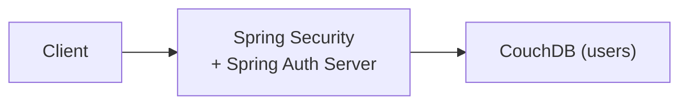
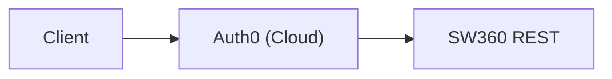
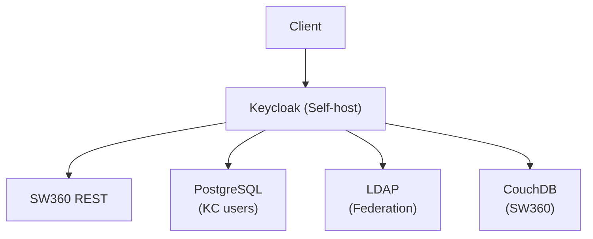

# Decision Analysis and Resolution: SW360 Authentication Provider

**Created by:** SW360 Architecture Team  
**Original Decision:** 2022  
**Reformatted:** April 2026  
**Status:** Accepted  
**Estimated read time:** 12 minutes

---

## Table of Contents

1. [Background](#background)
2. [Goal](#goal)
3. [Key Principles](#key-principles)
4. [Key Inputs, Assumptions and Restrictions](#key-inputs-assumptions-and-restrictions)
5. [Options Analysis](#options-analysis)
   - [Option 1 - Spring Security Standalone](#option-1---spring-security-standalone)
   - [Option 2 - Auth0](#option-2---auth0)
   - [Option 3 - Keycloak](#option-3---keycloak)
   - [Option 4 - Okta](#option-4---okta)
   - [Option 5 - Custom OAuth2 Server](#option-5---custom-oauth2-server)
6. [Criteria for Making a Decision](#criteria-for-making-a-decision)
7. [Final Decision](#final-decision)
8. [Contributors](#contributors)
9. [Implementation Details](#implementation-details)

---

## Background

SW360 originally used Liferay Portal's built-in authentication, which coupled user management to the UI layer. With the migration away from Liferay toward a REST-first architecture, several challenges emerged:

- **Liferay Coupling**: Authentication was tightly bound to the portal framework
- **No API Authentication**: REST API needed OAuth2/OIDC support
- **Enterprise SSO**: Customers required integration with corporate identity providers
- **Programmatic Access**: CI/CD pipelines needed API tokens
- **Centralized Management**: User provisioning across multiple SW360 instances

**Why This Decision Matters:** Authentication is a critical security component that affects every user interaction, API call, and integration point.

---

## Goal

The goal of this decision analysis is to:
1. Decouple authentication from the Liferay portal layer
2. Enable OAuth2/OIDC for modern API authentication
3. Support enterprise SSO with LDAP/AD/SAML identity providers
4. Provide centralized user management
5. Enable API tokens for programmatic access
6. Maintain self-hosted deployment option (no cloud dependency)

---

## Key Principles

| # | Principle | Description |
|---|-----------|-------------|
| 1 | **Standards-Based** | Use OAuth2/OIDC for modern authentication |
| 2 | **Self-Hosted Option** | No mandatory cloud dependencies |
| 3 | **Enterprise Integration** | Support LDAP, Active Directory, SAML |
| 4 | **Open Source** | Avoid vendor lock-in |
| 5 | **Customizable** | Support SW360-specific user storage and events |

---

## Key Inputs, Assumptions and Restrictions

| Type | Description |
|------|-------------|
| **Input** | SW360 stores users in CouchDB with custom attributes |
| **Input** | Many deployments use corporate LDAP/Active Directory |
| **Input** | REST API requires stateless JWT-based authentication |
| **Assumption** | Enterprise customers will want SSO integration |
| **Assumption** | Self-hosted deployment is primary model |
| **Restriction** | Must support custom user storage provider for CouchDB |
| **Restriction** | No mandatory cloud service dependencies |

---

## Options Analysis

### Option 1 - Spring Security Standalone

#### Summary
Use Spring Security's built-in authentication with a custom UserDetailsService connected to SW360's CouchDB user database. Build OAuth2 authorization server using Spring Authorization Server.

#### Conceptual View


#### Impact / Changes Required
- Implement custom UserDetailsService for CouchDB
- Build OAuth2 authorization server endpoints
- Implement token management (issuance, refresh, revocation)
- Build admin UI for user management

#### SWOT Analysis

| Category | Analysis |
|----------|----------|
| **Strengths** | 1. No additional component to deploy<br/>2. Full control over authentication flow<br/>3. Tight integration with Spring Boot<br/>4. Single technology stack |
| **Weaknesses** | 1. Must implement OAuth2 server from scratch<br/>2. No built-in admin UI<br/>3. No LDAP/SAML federation out of box<br/>4. Must maintain security updates ourselves<br/>5. Significant development effort |
| **Opportunities** | 1. Customization without limitations |
| **Threats** | 1. Security vulnerabilities from custom implementation<br/>2. High maintenance burden<br/>3. Missing enterprise features |

---

### Option 2 - Auth0

#### Summary
Use Auth0, a cloud-based identity-as-a-service platform providing OAuth2/OIDC, SSO, MFA, and user management out of the box.

#### Conceptual View


#### Impact / Changes Required
- Configure Auth0 tenant and application
- Integrate Spring Security with Auth0 JWT validation
- Sync users between Auth0 and SW360 CouchDB
- Configure enterprise connections for LDAP/SAML

#### SWOT Analysis

| Category | Analysis |
|----------|----------|
| **Strengths** | 1. Full-featured identity platform<br/>2. Excellent documentation and support<br/>3. Enterprise SSO out of box<br/>4. MFA, passwordless, social login<br/>5. No infrastructure to maintain |
| **Weaknesses** | 1. **Cloud dependency—violates self-hosted requirement**<br/>2. Subscription costs scale with users<br/>3. Data residency concerns<br/>4. Vendor lock-in |
| **Opportunities** | 1. Rapid implementation<br/>2. Advanced security features |
| **Threats** | 1. Cloud dependency unacceptable for many deployments<br/>2. Pricing changes<br/>3. Service availability dependency |

---

### Option 3 - Keycloak

#### Summary
Use Keycloak, an open-source identity and access management solution from Red Hat. Self-hosted with OAuth2/OIDC, SAML, LDAP federation, and customizable user storage providers.

#### Conceptual View


#### Impact / Changes Required
- Deploy Keycloak with PostgreSQL
- Develop custom user storage provider for CouchDB
- Create event listener for user synchronization
- Configure Spring Security for JWT validation

#### SWOT Analysis

| Category | Analysis |
|----------|----------|
| **Strengths** | 1. **Fully self-hosted—no cloud dependency**<br/>2. Open source with Red Hat backing<br/>3. Enterprise SSO (LDAP, SAML, OIDC) out of box<br/>4. Customizable user storage providers<br/>5. Fine-grained authorization<br/>6. Active community and regular updates<br/>7. MFA, social login, brute force protection |
| **Weaknesses** | 1. Additional component to deploy and maintain<br/>2. Requires PostgreSQL for its data<br/>3. Resource consumption (memory/CPU)<br/>4. Learning curve for administration<br/>5. Custom provider development needed |
| **Opportunities** | 1. Custom SW360 user storage provider<br/>2. Event listeners for user sync<br/>3. Theme customization for branding |
| **Threats** | 1. Keycloak upgrades may break custom providers<br/>2. Must maintain custom provider code<br/>3. OAuth2 flows can be complex to debug |

---

### Option 4 - Okta

#### Summary
Use Okta, an enterprise identity management platform providing comprehensive IAM capabilities with cloud and on-premises options.

#### Conceptual View
```
┌─────────────┐     ┌──────────────┐     ┌──────────────┐
│   Client    │────►│    Okta      │────►│  SW360 REST  │
└─────────────┘     │   (Cloud)    │     └──────────────┘
                    └──────────────┘
```

#### Impact / Changes Required
- Purchase Okta subscription
- Configure Okta tenant
- Integrate with Spring Security

#### SWOT Analysis

| Category | Analysis |
|----------|----------|
| **Strengths** | 1. Enterprise-grade IAM<br/>2. Excellent support and SLA<br/>3. Comprehensive security features<br/>4. Wide integration ecosystem |
| **Weaknesses** | 1. **Commercial product with significant cost**<br/>2. Cloud-first (on-prem is limited)<br/>3. Vendor lock-in<br/>4. May be overkill for SW360 needs |
| **Opportunities** | 1. Enterprise customer familiarity |
| **Threats** | 1. Cost prohibitive for open-source project<br/>2. Cloud dependency for most features<br/>3. Acquisition risks |

---

### Option 5 - Custom OAuth2 Server

#### Summary
Build a custom OAuth2 authorization server tailored specifically for SW360's needs, using libraries like Spring Authorization Server or nimbus-jose-jwt.

#### Conceptual View
```
┌─────────────┐     ┌──────────────────────┐     ┌──────────┐
│   Client    │────►│  Custom OAuth2       │────►│ CouchDB  │
└─────────────┘     │  Server              │     │ (users)  │
                    └──────────────────────┘     └──────────┘
```

#### Impact / Changes Required
- Design and implement complete OAuth2 server
- Build admin UI
- Implement federation (LDAP, SAML)
- Ongoing security maintenance

#### SWOT Analysis

| Category | Analysis |
|----------|----------|
| **Strengths** | 1. Complete control over features<br/>2. No external dependencies<br/>3. Tailored to SW360 needs |
| **Weaknesses** | 1. Massive development effort<br/>2. Security risks from custom implementation<br/>3. Must implement all enterprise features<br/>4. Ongoing maintenance burden<br/>5. No community support |
| **Opportunities** | 1. Perfect fit for requirements |
| **Threats** | 1. High risk of security vulnerabilities<br/>2. Resource drain for maintenance<br/>3. Difficult to match enterprise feature set |

---

## Criteria for Making a Decision

### T-Shirt Sizing Scale

| T-Shirt Size | Numeric Value | Meaning |
|--------------|---------------|---------|
| XS | 1.0 | Worst for this aspect |
| S | 2.5 | Poor |
| S-M | 3.75 | Below Average |
| M | 5.0 | Average |
| M-L | 6.25 | Above Average |
| L | 7.5 | Good |
| L-XL | 8.75 | Very Good |
| XL | 10.0 | Best for this aspect |

### Weighted Evaluation Matrix

| Criteria | Description | Weight | Spring Standalone | | Auth0 | | Keycloak | | Okta | | Custom | |
|----------|-------------|--------|-------------------|-------|-------|-------|----------|-------|------|-------|--------|-------|
| | | | Rating | Score | Rating | Score | Rating | Score | Rating | Score | Rating | Score |
| **Self-Hosted Option** | No cloud dependency | 10 | XL | 100.0 | XS | 10.0 | XL | 100.0 | S | 25.0 | XL | 100.0 |
| **Enterprise SSO** | LDAP, AD, SAML support | 9 | S | 22.5 | XL | 90.0 | L-XL | 78.75 | XL | 90.0 | S | 22.5 |
| **OAuth2/OIDC Standards** | Modern authentication | 9 | M-L | 56.25 | XL | 90.0 | XL | 90.0 | XL | 90.0 | M | 45.0 |
| **Open Source** | No vendor lock-in | 8 | XL | 80.0 | S | 20.0 | XL | 80.0 | XS | 8.0 | XL | 80.0 |
| **Custom User Storage** | CouchDB integration | 8 | L | 60.0 | S-M | 30.0 | L-XL | 70.0 | S-M | 30.0 | XL | 80.0 |
| **Development Effort** | Time to implement | 8 | S-M | 30.0 | L-XL | 70.0 | L | 60.0 | L-XL | 70.0 | XS | 8.0 |
| **Security Updates** | Regular patches | 8 | M | 40.0 | XL | 80.0 | L-XL | 70.0 | XL | 80.0 | S | 20.0 |
| **Admin UI** | User management UI | 6 | XS | 6.0 | XL | 60.0 | L-XL | 52.5 | XL | 60.0 | XS | 6.0 |
| **MFA Support** | Multi-factor auth | 6 | S | 15.0 | XL | 60.0 | L-XL | 52.5 | XL | 60.0 | S | 15.0 |
| **Community Support** | Help resources | 6 | L | 45.0 | L-XL | 52.5 | L-XL | 52.5 | L | 45.0 | XS | 6.0 |
| **Cost** | Licensing/infra cost | 7 | XL | 70.0 | M | 35.0 | L-XL | 61.25 | S | 17.5 | L | 52.5 |
| | | **TOTAL** | | **524.75** | | **597.5** | | **767.5** | | **575.5** | | **435.0** |

### Score Summary

| Rank | Option | Total Score | Recommendation |
|------|--------|-------------|----------------|
| 🥇 1 | **Keycloak** | **767.5** | ✅ **SELECTED** |
| 🥈 2 | Auth0 | 597.5 | ❌ Cloud dependency |
| 🥉 3 | Okta | 575.5 | ❌ Commercial cost |
| 4 | Spring Standalone | 524.75 | ❌ Missing enterprise features |
| 5 | Custom OAuth2 | 435.0 | ❌ Too risky |

---

## Final Decision

### Selected Option: **Keycloak**

### Rationale

Keycloak was selected as the identity provider for SW360 based on:

1. **Highest Weighted Score (767.5)** - Clear winner when balancing all requirements

2. **Self-Hosted (XL)** - Critical requirement met:
   - No cloud dependency
   - Full control over user data
   - Compliant with data residency requirements

3. **Enterprise SSO (L-XL)** - Built-in support for:
   - LDAP/Active Directory federation
   - SAML 2.0 identity providers
   - OpenID Connect
   - Social login providers

4. **Open Source (XL)** - Apache 2.0 license with Red Hat backing:
   - No vendor lock-in
   - Active community
   - Regular security updates

5. **Custom User Storage (L-XL)** - Extensible architecture allows:
   - SW360 CouchDB user storage provider
   - Event listeners for user synchronization
   - Custom authentication flows

### Implementation Notes

**Architecture:**
```
┌─────────┐     ┌──────────┐     ┌──────────────┐
│  User   │────►│ Keycloak │────►│  SW360 REST  │
└─────────┘     └──────────┘     └──────────────┘
                     │                   │
              ┌──────┴──────┐     ┌──────┴──────┐
              │  PostgreSQL │     │   CouchDB   │
              │ (KC users)  │     │(SW360 users)│
              └─────────────┘     └─────────────┘
```

**Custom Providers:**
- `sw360-keycloak-user-storage-provider.jar` - Reads users from CouchDB
- `sw360-keycloak-event-listener.jar` - Syncs Keycloak events to SW360

### Review Triggers

This decision should be revisited if:
- [ ] Keycloak project becomes unmaintained
- [ ] Cloud-first deployment becomes primary model
- [ ] Custom provider maintenance becomes unsustainable
- [ ] Alternative open-source IAM with better fit emerges

---

## Contributors

| Name | Role | Contribution |
|------|------|--------------|
| SW360 Architecture Team | Decision Makers | Requirements analysis |
| Security Team | Stakeholders | Security requirements |
| Operations Team | Stakeholders | Deployment considerations |

---

## Implementation Details

### Spring Security Configuration

```yaml
spring:
  security:
    oauth2:
      resourceserver:
        jwt:
          issuer-uri: http://keycloak:8083/realms/sw360
          jwk-set-uri: http://keycloak:8083/realms/sw360/protocol/openid-connect/certs
```

### Authentication Flow

1. User accesses SW360 UI/API
2. Redirected to Keycloak login
3. Keycloak authenticates (local DB or federated)
4. JWT token issued
5. Token sent to SW360 API
6. SW360 validates token via JWKS endpoint
7. User extracted from token claims

### API Token Support

For programmatic access, SW360 also supports API tokens:
```properties
rest.apitoken.read.validity.days=90
rest.apitoken.write.validity.days=30
rest.apitoken.hash.salt=$2a$04$Software360RestApiSalt
```

---

## Consequences Summary

### Positive
- ✅ SSO Support—users log in once for multiple applications
- ✅ JWT Tokens—stateless authentication, scalable
- ✅ Federation—connect to existing LDAP/AD directories
- ✅ Security—battle-tested OAuth2/OIDC implementation
- ✅ API Tokens—native support for service accounts
- ✅ Self-hosted—no cloud dependency

### Negative
- ⚠️ Additional component to deploy and maintain
- ⚠️ OAuth2 flows can be complex to troubleshoot
- ⚠️ Resource usage—Keycloak requires memory/CPU
- ⚠️ Learning curve for Keycloak administration
- ⚠️ Custom provider maintenance required

### Technical Debt Created
- Custom user storage provider must be maintained
- Keycloak version compatibility testing required
- PostgreSQL database added to infrastructure

---

## Revision History

| Version | Date | Author | Changes |
|---------|------|--------|---------|
| 1.0 | 2022 | Architecture Team | Initial decision |
| 2.0 | April 2026 | Bibhuti Bhusan Dash | Reformatted to DAR/SWOT template |
