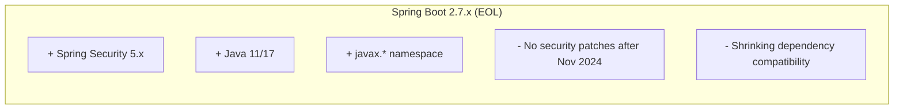
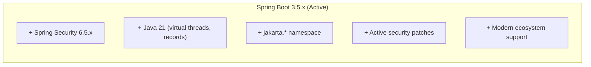
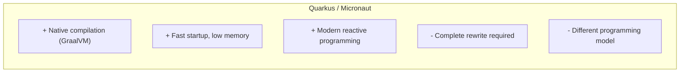

# Decision Analysis and Resolution: Spring Boot Version Migration

**Created by:** SW360 Architecture Team  
**Original Decision:** 2024  
**Reformatted:** April 2026  
**Status:** Accepted  
**Estimated read time:** 10 minutes

---

## Table of Contents

1. [Background](#background)
2. [Goal](#goal)
3. [Key Principles](#key-principles)
4. [Key Inputs, Assumptions and Restrictions](#key-inputs-assumptions-and-restrictions)
5. [Options Analysis](#options-analysis)
   - [Option 1 - Stay on Spring Boot 2.7.x](#option-1---stay-on-spring-boot-27x)
   - [Option 2 - Migrate to Spring Boot 3.x](#option-2---migrate-to-spring-boot-3x)
   - [Option 3 - Alternative Framework Migration](#option-3---alternative-framework-migration)
6. [Criteria for Making a Decision](#criteria-for-making-a-decision)
7. [Final Decision](#final-decision)
8. [Migration Effort](#migration-effort)
9. [Contributors](#contributors)

---

## Background

SW360's REST API was built on Spring Boot 2.x with Spring Security 5.x. Several factors drove the need to evaluate migration:

1. **End of Life**: Spring Boot 2.x reached end of commercial support in November 2024
2. **Security Updates**: Spring Security 6.x includes important security improvements
3. **Java Evolution**: Spring Boot 3.x fully supports Java 21 features (virtual threads, records)
4. **Jakarta EE**: Industry migration from `javax.*` to `jakarta.*` namespace
5. **Dependency Ecosystem**: Many libraries dropping Spring Boot 2.x support

**Migration Scope:**
- Spring Boot 2.7.x → 3.5.x
- Spring Security 5.x → 6.5.x
- Java 11 → Java 21
- javax.* → jakarta.*

---

## Goal

The goal of this decision analysis is to:
1. Determine whether to migrate SW360 REST API to Spring Boot 3.x
2. Evaluate migration effort versus staying on unsupported version
3. Identify risks and mitigation strategies
4. Plan migration phases if proceeding

---

## Key Principles

| # | Principle | Description |
|---|-----------|-------------|
| 1 | **Security First** | Supported platforms with active security patches |
| 2 | **Long-term Viability** | Choose the path with longest support horizon |
| 3 | **Developer Experience** | Modern tooling, language features |
| 4 | **Minimal Disruption** | Maintain API compatibility for clients |
| 5 | **Incremental Migration** | Phased approach to reduce risk |

---

## Key Inputs, Assumptions and Restrictions

| Type | Description |
|------|-------------|
| **Input** | Spring Boot 2.x end of support: November 2024 |
| **Input** | Spring Boot 3.x requires Java 17+ (Java 21 recommended) |
| **Input** | Jakarta EE namespace change (`javax.*` → `jakarta.*`) is breaking |
| **Assumption** | Client applications can adapt to any API changes |
| **Assumption** | Development team can allocate time for migration |
| **Restriction** | Must maintain backward compatibility for REST API contracts |
| **Restriction** | All dependencies must support Spring Boot 3.x |

---

## Options Analysis

### Option 1 - Stay on Spring Boot 2.7.x

#### Summary
Continue using Spring Boot 2.7.x indefinitely, accepting that security patches and updates will no longer be provided. Monitor for critical vulnerabilities and patch manually if necessary.

#### Conceptual View


#### Impact / Changes Required
- No code changes required
- Monitor security advisories manually
- Fork and patch dependencies if vulnerabilities discovered
- Accept increasing technical debt

#### SWOT Analysis

| Category | Analysis |
|----------|----------|
| **Strengths** | 1. Zero migration effort<br/>2. No risk of regression<br/>3. Stable, known platform<br/>4. Development can focus on features |
| **Weaknesses** | 1. **No security patches after Nov 2024**<br/>2. Growing technical debt<br/>3. Dependencies dropping support<br/>4. Java 11 becoming outdated<br/>5. Developer experience degrading |
| **Opportunities** | 1. Delay costs until absolutely necessary |
| **Threats** | 1. **Critical security vulnerability with no patch**<br/>2. Compliance failures in security audits<br/>3. Increasing migration cost over time<br/>4. Developer retention issues |

---

### Option 2 - Migrate to Spring Boot 3.x

#### Summary
Migrate SW360 REST API to Spring Boot 3.5.x with Java 21, including the namespace migration from `javax.*` to `jakarta.*` and Spring Security configuration updates.

#### Conceptual View


#### Impact / Changes Required
- Namespace migration: `javax.*` → `jakarta.*`
- Spring Security configuration rewrite
- OpenAPI/SpringDoc version upgrade
- Test updates for new APIs
- Full regression testing

#### SWOT Analysis

| Category | Analysis |
|----------|----------|
| **Strengths** | 1. Active security patches<br/>2. Java 21 features (virtual threads, records)<br/>3. Modern OAuth2 resource server<br/>4. Ecosystem alignment<br/>5. Long-term support horizon |
| **Weaknesses** | 1. Significant migration effort<br/>2. Breaking changes require code updates<br/>3. Testing overhead<br/>4. Some dependencies may need replacement<br/>5. Learning curve for new APIs |
| **Opportunities** | 1. Adopt Java 21 features for performance<br/>2. Modernize security configuration<br/>3. Clean up deprecated APIs<br/>4. Attract developers with modern stack |
| **Threats** | 1. Regression bugs from migration<br/>2. Dependency incompatibilities<br/>3. Timeline pressure<br/>4. Hidden breaking changes |

---

### Option 3 - Alternative Framework Migration

#### Summary
Instead of migrating Spring Boot versions, consider migrating to an alternative framework such as Quarkus, Micronaut, or Helidon that offers native compilation and modern features.

#### Conceptual View


#### Impact / Changes Required
- Complete REST API rewrite
- New annotations, dependency injection
- Different testing frameworks
- Team retraining

#### SWOT Analysis

| Category | Analysis |
|----------|----------|
| **Strengths** | 1. Native compilation option<br/>2. Faster startup, lower memory<br/>3. Cloud-native design<br/>4. Modern reactive patterns |
| **Weaknesses** | 1. **Complete rewrite required**<br/>2. Team unfamiliar with framework<br/>3. Smaller ecosystem than Spring<br/>4. Breaks all existing integrations<br/>5. Massive timeline and cost |
| **Opportunities** | 1. Cloud/serverless optimization<br/>2. Performance improvements |
| **Threats** | 1. Project timeline unacceptable<br/>2. Risk of bugs in rewrite<br/>3. Loss of Spring ecosystem<br/>4. Team morale from massive change |

---

## Criteria for Making a Decision

### T-Shirt Sizing Scale

| T-Shirt Size | Numeric Value | Meaning |
|--------------|---------------|---------|
| XS | 1.0 | Worst for this aspect |
| S | 2.5 | Poor |
| S-M | 3.75 | Below Average |
| M | 5.0 | Average |
| M-L | 6.25 | Above Average |
| L | 7.5 | Good |
| L-XL | 8.75 | Very Good |
| XL | 10.0 | Best for this aspect |

### Weighted Evaluation Matrix

| Criteria | Description | Weight | Stay on 2.7 | | Migrate to 3.x | | Alternative | |
|----------|-------------|--------|-------------|-------|----------------|-------|-------------|-------|
| | | | Rating | Score | Rating | Score | Rating | Score |
| **Security Patches** | Active vulnerability fixes | 10 | XS | 10.0 | XL | 100.0 | L-XL | 87.5 |
| **Long-term Support** | Years of maintenance ahead | 9 | XS | 9.0 | L-XL | 78.75 | L | 67.5 |
| **Migration Effort** | Development time required | 8 | XL | 80.0 | M | 40.0 | XS | 8.0 |
| **Risk of Regression** | Breaking existing functionality | 8 | XL | 80.0 | M-L | 50.0 | XS | 8.0 |
| **Java 21 Features** | Virtual threads, records, etc. | 7 | XS | 7.0 | XL | 70.0 | XL | 70.0 |
| **Ecosystem Support** | Library compatibility | 8 | S-M | 30.0 | L-XL | 70.0 | M | 40.0 |
| **Developer Experience** | Modern tooling, debugging | 7 | M | 35.0 | L-XL | 61.25 | L | 52.5 |
| **Team Familiarity** | Knowledge of platform | 7 | XL | 70.0 | L | 52.5 | S | 17.5 |
| **Compliance** | Security audit requirements | 8 | S | 20.0 | XL | 80.0 | L-XL | 70.0 |
| **Performance** | Runtime efficiency | 6 | M | 30.0 | L | 45.0 | XL | 60.0 |
| | | **TOTAL** | | **371.0** | | **647.5** | | **481.0** |

### Score Summary

| Rank | Option | Total Score | Recommendation |
|------|--------|-------------|----------------|
| 🥇 1 | **Migrate to Spring Boot 3.x** | **647.5** | ✅ **SELECTED** |
| 🥈 2 | Alternative Framework | 481.0 | ❌ Too risky, complete rewrite |
| 🥉 3 | Stay on Spring Boot 2.7.x | 371.0 | ❌ Security risk unacceptable |

---

## Final Decision

### Selected Option: **Migrate to Spring Boot 3.5.x with Java 21**

### Rationale

Migration to Spring Boot 3.x was selected based on:

1. **Highest Weighted Score (647.5)** - Best balance of effort versus benefit

2. **Security Patches (XL)** - Critical requirement:
   - Active vulnerability fixes
   - Compliance audit requirements
   - CVE response SLA

3. **Long-term Support (L-XL)** - Spring Boot 3.x will be maintained for years

4. **Java 21 Features (XL)** - Significant improvements:
   - Virtual threads for improved scalability
   - Records for cleaner data classes
   - Pattern matching for cleaner code
   - Better garbage collection

5. **Ecosystem Alignment (L-XL)** - Libraries are migrating to Jakarta EE

---

## Migration Effort

### Effort Estimation by Area

| Area | Effort | Notes |
|------|--------|-------|
| Namespace migration | Medium | `javax.*` → `jakarta.*` (largely automated) |
| Security configuration | High | New DSL, authorization changes |
| OpenAPI/SpringDoc | Medium | Version upgrade, annotation changes |
| Test updates | Medium | MockMvc, security test changes |
| Dependency updates | Medium | Some libraries need replacement |
| Regression testing | High | Full API test cycle |

### Key Code Changes

#### 1. Namespace Migration
```java
// Before (Spring Boot 2.x)
import javax.servlet.http.HttpServletRequest;
import javax.validation.Valid;

// After (Spring Boot 3.x)
import jakarta.servlet.http.HttpServletRequest;
import jakarta.validation.Valid;
```

#### 2. Security Configuration
```java
// Before (Spring Boot 2.x)
@Configuration
public class SecurityConfig extends WebSecurityConfigurerAdapter {
    @Override
    protected void configure(HttpSecurity http) throws Exception {
        http.authorizeRequests()
            .antMatchers("/api/**").authenticated()
            .and()
            .oauth2ResourceServer().jwt();
    }
}

// After (Spring Boot 3.x)
@Configuration
public class SecurityConfig {
    @Bean
    public SecurityFilterChain filterChain(HttpSecurity http) throws Exception {
        http.authorizeHttpRequests(auth -> auth
                .requestMatchers("/api/**").authenticated()
            )
            .oauth2ResourceServer(oauth2 -> oauth2.jwt(Customizer.withDefaults()));
        return http.build();
    }
}
```

#### 3. OpenAPI/SpringDoc
```xml
<!-- Before -->
<artifactId>springdoc-openapi-ui</artifactId>
<version>1.x</version>

<!-- After -->
<artifactId>springdoc-openapi-starter-webmvc-ui</artifactId>
<version>2.x</version>
```

### Version Matrix

| Component | Before | After |
|-----------|--------|-------|
| Spring Boot | 2.7.x | 3.5.x |
| Spring Security | 5.8.x | 6.5.x |
| Java | 11/17 | 21 |
| Tomcat | 9.x | 11.x |
| Servlet Spec | 4.0 (javax) | 6.0 (jakarta) |
| SpringDoc | 1.x | 2.x |

### Review Triggers

This decision should be revisited if:
- [ ] Spring Boot 4.x is released with significant benefits
- [ ] Critical dependency incompatibility is discovered
- [ ] Performance regression is unacceptable

---

## Contributors

| Name | Role | Contribution |
|------|------|--------------|
| SW360 Architecture Team | Decision Makers | Technical analysis |
| Development Team | Implementers | Migration effort, testing |
| Security Team | Stakeholders | Compliance requirements |

---

## Consequences Summary

### Positive
- ✅ Supported platform—active security patches and updates
- ✅ Java 21 features—records, virtual threads, better performance
- ✅ Modern OAuth2—improved resource server configuration
- ✅ Better tooling—latest IDE support and debugging
- ✅ Dependency updates—access to latest library versions
- ✅ Compliance—meets security audit requirements

### Negative
- ⚠️ Breaking changes—significant code modifications required
- ⚠️ Testing effort—full regression testing needed
- ⚠️ Learning curve—new security configuration patterns
- ⚠️ Compatibility—some older libraries may not support Spring Boot 3

### Technical Debt Addressed
- Removed deprecated APIs
- Modernized security configuration
- Updated to supported Java LTS version

---

## Revision History

| Version | Date | Author | Changes |
|---------|------|--------|---------|
| 1.0 | 2024 | Architecture Team | Initial decision |
| 2.0 | April 2026 | Bibhuti Bhusan Dash | Reformatted to DAR/SWOT template |
