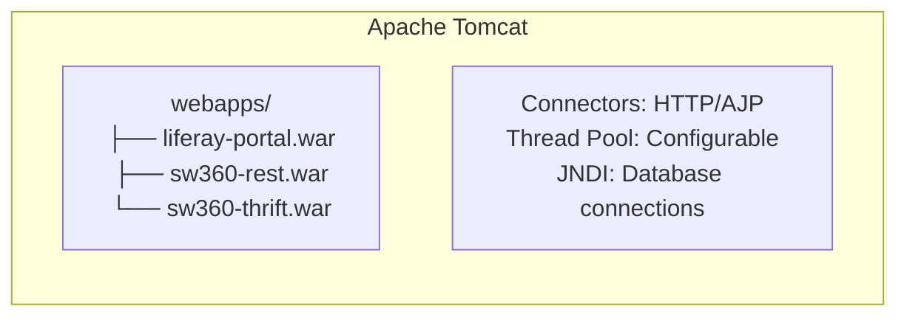
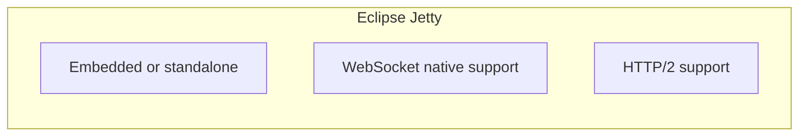
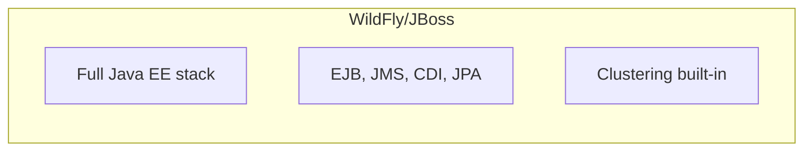

# Decision Analysis and Resolution: SW360 Servlet Container

**Created by:** SW360 Architecture Team  
**Original Decision:** 2014  
**Reformatted:** April 2026  
**Status:** Accepted  
**Estimated read time:** 8 minutes

---

## Table of Contents

1. [Background](#background)
2. [Goal](#goal)
3. [Key Principles](#key-principles)
4. [Key Inputs, Assumptions and Restrictions](#key-inputs-assumptions-and-restrictions)
5. [Options Analysis](#options-analysis)
   - [Option 1 - Apache Tomcat](#option-1---apache-tomcat)
   - [Option 2 - Eclipse Jetty](#option-2---eclipse-jetty)
   - [Option 3 - WildFly/JBoss](#option-3---wildflyjboss)
   - [Option 4 - GlassFish](#option-4---glassfish)
6. [Criteria for Making a Decision](#criteria-for-making-a-decision)
7. [Final Decision](#final-decision)
8. [Evolution](#evolution)
9. [Contributors](#contributors)

---

## Background

SW360 was originally designed as a Liferay Portal application, which required a servlet container to host web applications. The servlet container needed to:

- Host the Liferay portal WAR and portlet applications
- Support multiple web applications (portlets, REST services)
- Provide standard Java EE/Jakarta EE servlet capabilities
- Enable production-grade deployment with proven reliability
- Integrate well with Spring-based applications

**Why This Decision Matters:** The servlet container is the runtime foundation for all SW360 web components, affecting deployment, performance, and operational aspects.

---

## Goal

The goal of this decision analysis is to:
1. Select a servlet container that supports Liferay Portal deployment
2. Enable reliable production deployments
3. Support future Spring Boot integration
4. Minimize operational complexity

---

## Key Principles

| # | Principle | Description |
|---|-----------|-------------|
| 1 | **Production Proven** | Battle-tested in enterprise environments |
| 2 | **Liferay Compatibility** | Recommended by Liferay for portal deployments |
| 3 | **Spring Integration** | Seamless Spring Boot embedded support |
| 4 | **Operational Simplicity** | Well-known by operations teams |
| 5 | **Active Maintenance** | Regular updates and security patches |

---

## Key Inputs, Assumptions and Restrictions

| Type | Description |
|------|-------------|
| **Input** | Liferay Portal recommends Tomcat as deployment platform |
| **Input** | Spring Boot embeds Tomcat by default |
| **Input** | Operations team has existing Tomcat expertise |
| **Assumption** | Deployment will remain on-premises initially |
| **Assumption** | Embedded deployment (Spring Boot) is future direction |
| **Restriction** | Must support Jakarta EE servlet specification |
| **Restriction** | Must handle concurrent users in production |

---

## Options Analysis

### Option 1 - Apache Tomcat

#### Summary
Use Apache Tomcat, the most widely deployed open-source servlet container. Lightweight, reliable, and the recommended platform for both Liferay Portal and Spring Boot applications.

#### Conceptual View


#### Impact / Changes Required
- Deploy WAR files to webapps directory
- Configure server.xml for connectors and resources
- Tune thread pools for production load

#### SWOT Analysis

| Category | Analysis |
|----------|----------|
| **Strengths** | 1. **Most widely deployed servlet container**<br/>2. Excellent Liferay compatibility (recommended)<br/>3. Spring Boot default embedded server<br/>4. Extensive documentation and community<br/>5. Well-known by operations teams<br/>6. Mature, stable, reliable |
| **Weaknesses** | 1. Configuration tuning required for production<br/>2. Not a full Java EE container<br/>3. Heavier than Jetty for simple apps |
| **Opportunities** | 1. Seamless transition to embedded (Spring Boot)<br/>2. Large ecosystem of tools and monitoring<br/>3. Docker images readily available |
| **Threats** | 1. Configuration drift across environments<br/>2. Security patches require restarts |

---

### Option 2 - Eclipse Jetty

#### Summary
Use Eclipse Jetty, a lightweight, embeddable servlet container known for its small footprint and fast startup time.

#### Conceptual View


#### Impact / Changes Required
- Configure Jetty for Liferay deployment
- Different configuration format than Tomcat
- May need additional modules for features

#### SWOT Analysis

| Category | Analysis |
|----------|----------|
| **Strengths** | 1. Lightweight and fast startup<br/>2. Excellent for embedded deployment<br/>3. Good HTTP/2 and WebSocket support<br/>4. Eclipse Foundation backing |
| **Weaknesses** | 1. **Liferay has limited Jetty support**<br/>2. Different configuration than Tomcat<br/>3. Smaller community than Tomcat<br/>4. Operations team less familiar |
| **Opportunities** | 1. Better for microservices<br/>2. Spring Boot alternative embed |
| **Threats** | 1. Limited Liferay testing on Jetty<br/>2. Potential compatibility issues<br/>3. Less operational expertise available |

---

### Option 3 - WildFly/JBoss

#### Summary
Use WildFly (formerly JBoss AS), a full Java EE application server providing comprehensive enterprise features including EJB, JMS, and clustering.

#### Conceptual View


#### Impact / Changes Required
- Deploy as EAR or WAR
- Configure subsystems for features
- Larger infrastructure footprint

#### SWOT Analysis

| Category | Analysis |
|----------|----------|
| **Strengths** | 1. Full Java EE support<br/>2. Built-in clustering<br/>3. Enterprise management console<br/>4. Red Hat support available |
| **Weaknesses** | 1. **Heavy footprint—overkill for SW360**<br/>2. Slower startup<br/>3. Complex configuration<br/>4. More resources required<br/>5. Not Spring Boot default |
| **Opportunities** | 1. Enterprise features if needed later |
| **Threats** | 1. Unnecessary complexity<br/>2. Higher operational burden<br/>3. Resource waste |

---

### Option 4 - GlassFish

#### Summary
Use GlassFish, the reference implementation for Java EE/Jakarta EE specifications.

#### Conceptual View
```
┌────────────────────────────────────────────────┐
│               GlassFish                         │
├────────────────────────────────────────────────┤
│  Jakarta EE reference implementation            │
│  Full specification support                     │
└────────────────────────────────────────────────┘
```

#### Impact / Changes Required
- Deploy as WAR/EAR
- Configure admin console
- Learn GlassFish administration

#### SWOT Analysis

| Category | Analysis |
|----------|----------|
| **Strengths** | 1. Reference Jakarta EE implementation<br/>2. Specification-compliant<br/>3. Eclipse Foundation backing |
| **Weaknesses** | 1. **Limited adoption compared to Tomcat**<br/>2. Less community support<br/>3. Operations teams unfamiliar<br/>4. Not Liferay recommended |
| **Opportunities** | 1. Specification compliance |
| **Threats** | 1. Smaller community<br/>2. Less operational expertise<br/>3. Uncertain future direction |

---

## Criteria for Making a Decision

### T-Shirt Sizing Scale

| T-Shirt Size | Numeric Value | Meaning |
|--------------|---------------|---------|
| XS | 1.0 | Worst for this aspect |
| S | 2.5 | Poor |
| S-M | 3.75 | Below Average |
| M | 5.0 | Average |
| M-L | 6.25 | Above Average |
| L | 7.5 | Good |
| L-XL | 8.75 | Very Good |
| XL | 10.0 | Best for this aspect |

### Weighted Evaluation Matrix

| Criteria | Description | Weight | Tomcat | | Jetty | | WildFly | | GlassFish | |
|----------|-------------|--------|--------|-------|-------|-------|---------|-------|-----------|-------|
| | | | Rating | Score | Rating | Score | Rating | Score | Rating | Score |
| **Liferay Compatibility** | Recommended/supported | 10 | XL | 100.0 | M | 50.0 | L | 75.0 | M-L | 62.5 |
| **Spring Boot Integration** | Embedded server default | 9 | XL | 90.0 | L-XL | 78.75 | M | 45.0 | M | 45.0 |
| **Production Reliability** | Enterprise deployments | 9 | XL | 90.0 | L | 67.5 | L-XL | 78.75 | L | 67.5 |
| **Operations Familiarity** | Team expertise | 8 | XL | 80.0 | M | 40.0 | M-L | 50.0 | S-M | 30.0 |
| **Community & Documentation** | Help resources | 7 | XL | 70.0 | L | 52.5 | L | 52.5 | M-L | 43.75 |
| **Startup Time** | Fast bootstrapping | 5 | L | 37.5 | XL | 50.0 | M | 25.0 | M | 25.0 |
| **Resource Efficiency** | Memory/CPU usage | 6 | L | 45.0 | L-XL | 52.5 | M | 30.0 | M | 30.0 |
| **Configuration Simplicity** | Easy setup | 6 | L | 45.0 | L | 45.0 | M | 30.0 | M-L | 37.5 |
| **Active Maintenance** | Security updates | 8 | XL | 80.0 | L-XL | 70.0 | L-XL | 70.0 | L | 60.0 |
| | | **TOTAL** | | **637.5** | | **506.25** | | **456.25** | | **401.25** |

### Score Summary

| Rank | Option | Total Score | Recommendation |
|------|--------|-------------|----------------|
| 🥇 1 | **Apache Tomcat** | **637.5** | ✅ **SELECTED** |
| 🥈 2 | Eclipse Jetty | 506.25 | Alternative for microservices |
| 🥉 3 | WildFly/JBoss | 456.25 | ❌ Overkill |
| 4 | GlassFish | 401.25 | ❌ Limited adoption |

---

## Final Decision

### Selected Option: **Apache Tomcat**

### Rationale

Apache Tomcat was selected as the servlet container for SW360 based on:

1. **Highest Weighted Score (637.5)** - Clear winner across all criteria

2. **Liferay Compatibility (XL)** - Official recommendation:
   - Liferay Portal is tested extensively on Tomcat
   - Liferay documentation assumes Tomcat
   - Best integration and support

3. **Spring Boot Integration (XL)** - Future-proof:
   - Spring Boot embeds Tomcat by default
   - Seamless transition from external to embedded deployment
   - Same runtime in development and production

4. **Operations Familiarity (XL)** - Lower risk:
   - Most widely deployed servlet container
   - Operations teams have Tomcat experience
   - Abundant monitoring and management tools

5. **Production Reliability (XL)** - Battle-tested:
   - Powers major applications worldwide
   - Proven stability and scalability
   - Well-understood performance characteristics

### Current Configuration (Spring Boot 3.x)

```properties
# Embedded Tomcat is auto-configured by Spring Boot
server.port=8080
server.tomcat.threads.max=200
server.tomcat.threads.min-spare=10
server.tomcat.accept-count=100
```

---

## Evolution

### Servlet Container Version History

| SW360 Version | Tomcat Version | Servlet Spec | Notes |
|---------------|----------------|--------------|-------|
| Pre-18.x | Tomcat 9.x | Servlet 4.0 (javax) | External deployment |
| 18.x+ | Tomcat 10.x+ | Servlet 5.0+ (jakarta) | Spring Boot embedded |
| Current | Tomcat 11.x | Servlet 6.0 (jakarta) | Spring Boot 3.5.x |

### Deployment Model Evolution

| Era | Model | Notes |
|-----|-------|-------|
| 2014-2023 | External Tomcat + WAR | Liferay Portal deployment |
| 2024+ | Embedded Tomcat | Spring Boot executable JAR |

---

## Related Decisions

- **ADR-001**: Thrift services coexist with Tomcat servlet handling
- **ADR-004**: Spring Boot 3.x migration (Tomcat 11.x embedded)

---

## Contributors

| Name | Role | Contribution |
|------|------|--------------|
| SW360 Architecture Team | Decision Makers | Technical analysis |
| Operations Team | Stakeholders | Deployment requirements |

---

## Consequences Summary

### Positive
- ✅ Standard deployment model—WAR deployment familiar to Java operations
- ✅ Mature ecosystem—extensive tooling, monitoring, documentation
- ✅ Spring Boot default—embedded Tomcat simplifies modern deployments
- ✅ Stable APIs—servlet specification is backward compatible
- ✅ Team expertise—operations team knows Tomcat

### Negative
- ⚠️ Configuration tuning required for production
- ⚠️ Memory footprint heavier than Jetty for simple apps
- ⚠️ Version coupling with Jakarta EE requirements

### Neutral
- Jakarta EE migration—Tomcat 10+ uses `jakarta.*` namespace
- Both embedded and external deployment modes supported

---

## Revision History

| Version | Date | Author | Changes |
|---------|------|--------|---------|
| 1.0 | 2014 | Architecture Team | Initial decision |
| 2.0 | April 2026 | Bibhuti Bhusan Dash | Reformatted to DAR/SWOT template |
