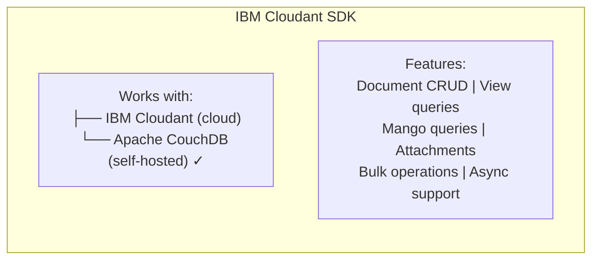
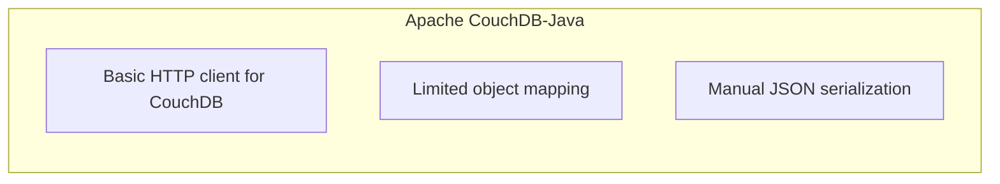
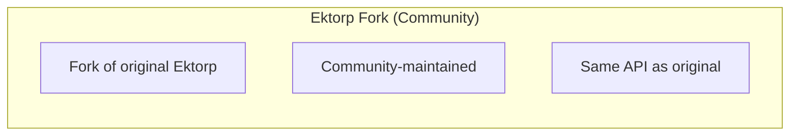
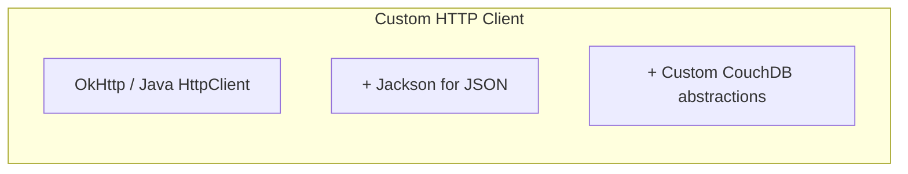

# Decision Analysis and Resolution: CouchDB Client Library Migration

**Created by:** SW360 Architecture Team  
**Original Decision:** 2024  
**Reformatted:** April 2026  
**Status:** Accepted  
**Estimated read time:** 10 minutes

---

## Table of Contents

1. [Background](#background)
2. [Goal](#goal)
3. [Key Principles](#key-principles)
4. [Key Inputs, Assumptions and Restrictions](#key-inputs-assumptions-and-restrictions)
5. [Options Analysis](#options-analysis)
   - [Option 1 - IBM Cloudant SDK](#option-1---ibm-cloudant-sdk)
   - [Option 2 - Apache CouchDB-Java](#option-2---apache-couchdb-java)
   - [Option 3 - Ektorp Fork (Community)](#option-3---ektorp-fork-community)
   - [Option 4 - Custom HTTP Client](#option-4---custom-http-client)
6. [Criteria for Making a Decision](#criteria-for-making-a-decision)
7. [Final Decision](#final-decision)
8. [Migration Path](#migration-path)
9. [Contributors](#contributors)

---

## Background

SW360 uses Apache CouchDB as its primary database (see ADR-002). The original CouchDB client library was **Ektorp**, a Java library that provided:

- Object mapping for CouchDB documents
- View query support
- Attachment handling

However, Ektorp became deprecated and unmaintained:
- **Last release:** 2016 (8+ years without updates)
- **Java compatibility:** No support for Java 17+, 21+
- **Security:** Known vulnerabilities not addressed
- **Features:** Missing support for CouchDB 3.x features (Mango queries, Nouveau)

**Why This Decision Matters:** The CouchDB client is used throughout SW360's data layer. An unmaintained library with security vulnerabilities poses significant risk.

---

## Goal

The goal of this decision analysis is to:
1. Replace the deprecated Ektorp library
2. Enable Java 17+ and Java 21 compatibility
3. Ensure active maintenance and security patches
4. Support CouchDB 3.x features
5. Minimize migration disruption

---

## Key Principles

| # | Principle | Description |
|---|-----------|-------------|
| 1 | **Active Maintenance** | Library must have regular updates |
| 2 | **Security Focus** | Quick response to vulnerabilities |
| 3 | **Modern Java** | Support Java 17+ and 21 |
| 4 | **CouchDB Compatible** | Work with vanilla Apache CouchDB |
| 5 | **Feature Parity** | Support all current Ektorp functionality |

---

## Key Inputs, Assumptions and Restrictions

| Type | Description |
|------|-------------|
| **Input** | Ektorp last updated in 2016, officially deprecated |
| **Input** | Ektorp has unpatched CVEs |
| **Input** | SW360 uses CouchDB 3.x with views and attachments |
| **Assumption** | IBM Cloudant SDK works with vanilla CouchDB |
| **Assumption** | Migration can be done incrementally |
| **Restriction** | Must not require CouchDB schema changes |
| **Restriction** | Must support all existing query patterns |

---

## Options Analysis

### Option 1 - IBM Cloudant SDK

#### Summary
Use IBM's Cloudant Java SDK (`cloudant-java-sdk`), which despite its name, is fully compatible with Apache CouchDB. IBM unified their cloud SDKs and actively maintains this library.

#### Conceptual View


#### Impact / Changes Required
- Refactor repository classes to use Cloudant SDK APIs
- Update connection configuration
- Migrate view query code to new API
- Update attachment handling code

#### SWOT Analysis

| Category | Analysis |
|----------|----------|
| **Strengths** | 1. **Active maintenance by IBM**<br/>2. Regular security updates<br/>3. Full Java 21 compatibility<br/>4. Modern builder-based API<br/>5. Async operations support<br/>6. Comprehensive documentation<br/>7. Works with vanilla CouchDB |
| **Weaknesses** | 1. API differs from Ektorp (migration effort)<br/>2. "Cloudant" name suggests IBM-only (misleading)<br/>3. Larger dependency tree<br/>4. Learning curve for new patterns |
| **Opportunities** | 1. Access to CouchDB 3.x features<br/>2. Better performance with async ops<br/>3. Future IBM enhancements |
| **Threats** | 1. IBM strategic changes<br/>2. API breaking changes in updates |

---

### Option 2 - Apache CouchDB-Java

#### Summary
Use Apache's official CouchDB Java client library, which provides basic HTTP client operations for CouchDB.

#### Conceptual View


#### Impact / Changes Required
- Build custom object mapping layer
- Implement view query abstraction
- Custom attachment handling
- More code to maintain

#### SWOT Analysis

| Category | Analysis |
|----------|----------|
| **Strengths** | 1. Apache-backed<br/>2. Minimal dependencies<br/>3. Official CouchDB project |
| **Weaknesses** | 1. **Limited features—basic HTTP only**<br/>2. No object mapping<br/>3. Manual JSON handling<br/>4. Limited documentation<br/>5. More custom code required |
| **Opportunities** | 1. Direct Apache support |
| **Threats** | 1. High maintenance burden<br/>2. Bugs in custom code<br/>3. Feature lag |

---

### Option 3 - Ektorp Fork (Community)

#### Summary
Use a community-maintained fork of Ektorp that attempts to keep the library updated with Java compatibility patches.

#### Conceptual View


#### Impact / Changes Required
- Update Maven dependency coordinates
- Test compatibility
- Minimal code changes

#### SWOT Analysis

| Category | Analysis |
|----------|----------|
| **Strengths** | 1. Same API—minimal migration<br/>2. Drop-in replacement potential<br/>3. Community support |
| **Weaknesses** | 1. **Uncertain maintenance commitment**<br/>2. No corporate backing<br/>3. May have unresolved CVEs<br/>4. Limited contributor base<br/>5. No guarantee of Java 21 support |
| **Opportunities** | 1. Could contribute to fork |
| **Threats** | 1. **Fork may become abandoned**<br/>2. Security vulnerabilities<br/>3. No SLA on updates<br/>4. Technical debt accumulation |

---

### Option 4 - Custom HTTP Client

#### Summary
Build a custom CouchDB client using a modern HTTP client library like OkHttp or Java's HttpClient, with Jackson for JSON serialization.

#### Conceptual View


#### Impact / Changes Required
- Design and implement complete client library
- Build all CouchDB operations from scratch
- Implement view query builders
- Handle attachments manually
- Ongoing maintenance

#### SWOT Analysis

| Category | Analysis |
|----------|----------|
| **Strengths** | 1. Full control<br/>2. No external dependencies<br/>3. Tailored to SW360 needs<br/>4. Modern HTTP client features |
| **Weaknesses** | 1. **Massive development effort**<br/>2. Must reinvent the wheel<br/>3. Ongoing maintenance burden<br/>4. Higher bug risk<br/>5. No community leverage |
| **Opportunities** | 1. Perfect fit for requirements |
| **Threats** | 1. Resource drain<br/>2. Bugs in custom code<br/>3. Developer time waste<br/>4. Missing CouchDB edge cases |

---

## Criteria for Making a Decision

### T-Shirt Sizing Scale

| T-Shirt Size | Numeric Value | Meaning |
|--------------|---------------|---------|
| XS | 1.0 | Worst for this aspect |
| S | 2.5 | Poor |
| S-M | 3.75 | Below Average |
| M | 5.0 | Average |
| M-L | 6.25 | Above Average |
| L | 7.5 | Good |
| L-XL | 8.75 | Very Good |
| XL | 10.0 | Best for this aspect |

### Weighted Evaluation Matrix

| Criteria | Description | Weight | Cloudant SDK | | CouchDB-Java | | Ektorp Fork | | Custom | |
|----------|-------------|--------|--------------|-------|--------------|-------|-------------|-------|--------|-------|
| | | | Rating | Score | Rating | Score | Rating | Score | Rating | Score |
| **Active Maintenance** | Regular updates | 10 | XL | 100.0 | M | 50.0 | S-M | 37.5 | M | 50.0 |
| **Security Patches** | CVE response | 10 | L-XL | 87.5 | M-L | 62.5 | S | 25.0 | M | 50.0 |
| **Java 21 Support** | Modern Java compat | 9 | XL | 90.0 | L | 67.5 | M | 45.0 | L-XL | 78.75 |
| **Feature Completeness** | All CouchDB features | 8 | L-XL | 70.0 | M | 40.0 | L | 60.0 | L | 60.0 |
| **Migration Effort** | Ease of transition | 8 | M-L | 50.0 | S-M | 30.0 | L-XL | 70.0 | XS | 8.0 |
| **Documentation** | Quality and coverage | 7 | L-XL | 61.25 | M | 35.0 | M | 35.0 | XS | 7.0 |
| **Corporate Backing** | Long-term viability | 8 | XL | 80.0 | L | 60.0 | XS | 8.0 | M | 40.0 |
| **CouchDB Compatibility** | Works with vanilla CouchDB | 8 | XL | 80.0 | XL | 80.0 | XL | 80.0 | XL | 80.0 |
| **Async Support** | Non-blocking operations | 5 | XL | 50.0 | M | 25.0 | S | 12.5 | L | 37.5 |
| **Community** | Help resources | 5 | L | 37.5 | M-L | 31.25 | M | 25.0 | XS | 5.0 |
| | | **TOTAL** | | **706.25** | | **481.25** | | **398.0** | | **416.25** |

### Score Summary

| Rank | Option | Total Score | Recommendation |
|------|--------|-------------|----------------|
| 🥇 1 | **IBM Cloudant SDK** | **706.25** | ✅ **SELECTED** |
| 🥈 2 | Apache CouchDB-Java | 481.25 | Limited features |
| 🥉 3 | Custom HTTP Client | 416.25 | ❌ Too much effort |
| 4 | Ektorp Fork | 398.0 | ❌ Uncertain future |

---

## Final Decision

### Selected Option: **IBM Cloudant SDK**

### Rationale

IBM Cloudant SDK was selected as the CouchDB client library based on:

1. **Highest Weighted Score (706.25)** - Clear winner on critical criteria

2. **Active Maintenance (XL)** - IBM corporate commitment:
   - Regular releases
   - Security vulnerability response
   - Feature additions

3. **Java 21 Support (XL)** - Full modern Java compatibility

4. **CouchDB Compatibility (XL)** - Despite the name, works perfectly with vanilla CouchDB:
   ```java
   // Works with Apache CouchDB, not just IBM Cloudant
   Cloudant client = new Cloudant("sw360", authenticator);
   client.setServiceUrl("http://couchdb:5984");
   ```

5. **Corporate Backing (XL)** - IBM's unified cloud SDK strategy ensures long-term viability

---

## Migration Path

### Phase 1: Add Cloudant SDK Alongside Ektorp
- Add dependency without removing Ektorp
- Create adapter layer for gradual migration

### Phase 2: Migrate Core Repositories
- Convert document CRUD operations
- Migrate view queries
- Update attachment handling

### Phase 3: Complete Migration
- Remove remaining Ektorp usages
- Remove Ektorp dependency
- Update documentation

### Migration Examples

**Ektorp (Old):**
```java
CouchDbConnector db = new StdCouchDbConnector("sw360db", couchDbInstance);
Component component = db.get(Component.class, id);
```

**Cloudant SDK (New):**
```java
GetDocumentOptions options = new GetDocumentOptions.Builder()
    .db("sw360db")
    .docId(id)
    .build();
Document doc = client.getDocument(options).execute().getResult();
Component component = mapper.convertValue(doc, Component.class);
```

### Maven Dependency

```xml
<dependency>
    <groupId>com.ibm.cloud</groupId>
    <artifactId>cloudant</artifactId>
    <version>0.8.x</version>
</dependency>
```

---

## Contributors

| Name | Role | Contribution |
|------|------|--------------|
| SW360 Architecture Team | Decision Makers | Technical analysis |
| Development Team | Implementers | Migration, testing |

---

## Consequences Summary

### Positive
- ✅ Active maintenance—regular updates and security patches
- ✅ Corporate backing—IBM's commitment to the SDK
- ✅ Modern API—clean, builder-based design
- ✅ Async support—non-blocking operations for performance
- ✅ Documentation—comprehensive IBM documentation
- ✅ Java 21—full modern Java support

### Negative
- ⚠️ Migration effort—refactoring from Ektorp APIs required
- ⚠️ IBM branding—name suggests Cloudant-only
- ⚠️ Dependency size—larger dependency tree
- ⚠️ Learning curve—new API patterns for developers

### Technical Debt Addressed
- Eliminated unmaintained library (Ektorp)
- Resolved unpatched security vulnerabilities
- Enabled Java 21 compatibility
- Gained access to CouchDB 3.x features

---

## Revision History

| Version | Date | Author | Changes |
|---------|------|--------|---------|
| 1.0 | 2024 | Architecture Team | Initial decision |
| 2.0 | April 2026 | Bibhuti Bhusan Dash | Reformatted to DAR/SWOT template |
