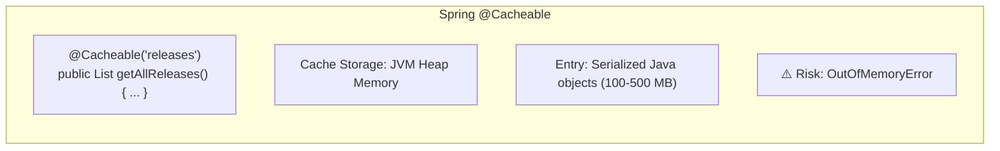
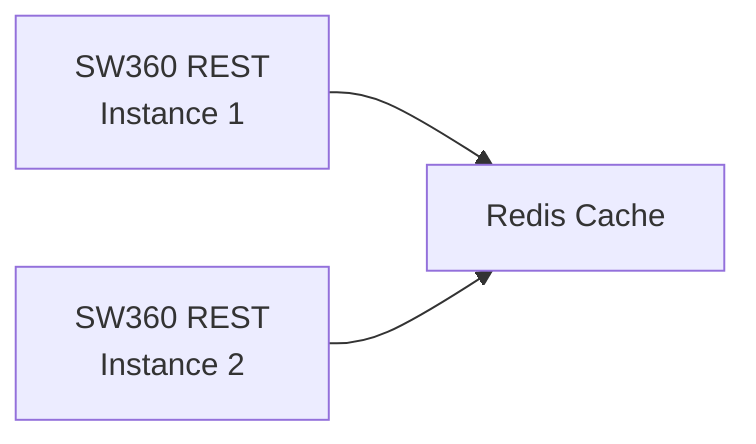
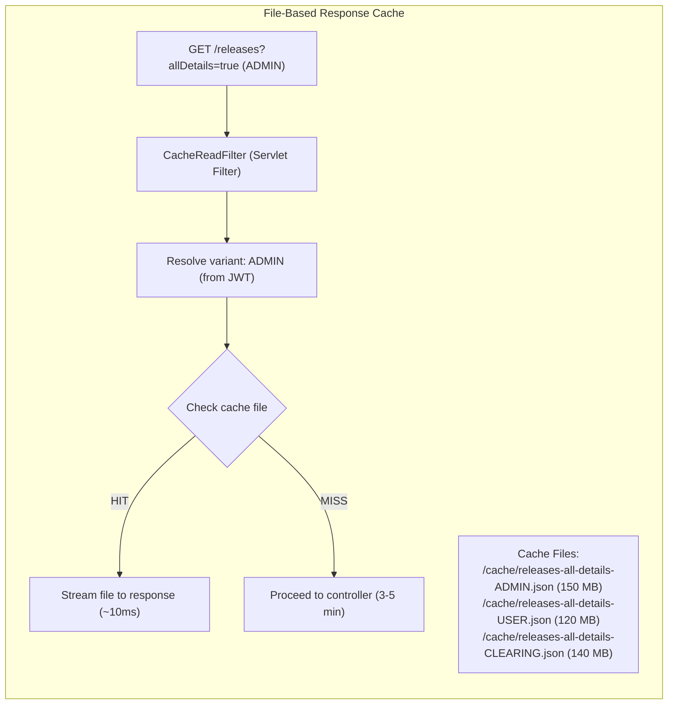
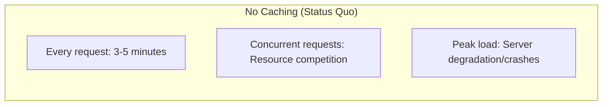
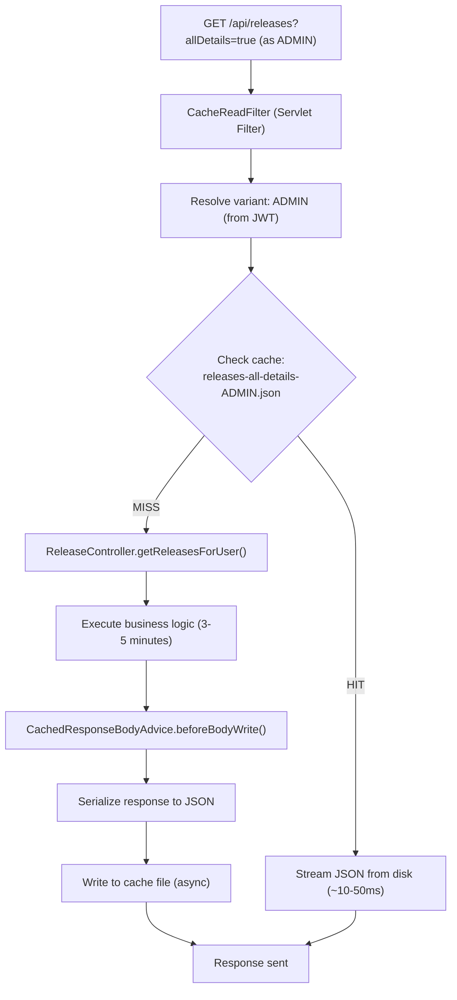

# Decision Analysis and Resolution: REST API Response Caching

**Created by:** SW360 Architecture Team  
**Original Decision:** 2026  
**Reformatted:** April 2026  
**Status:** Accepted  
**Estimated read time:** 12 minutes

---

## Table of Contents

1. [Background](#background)
2. [Goal](#goal)
3. [Key Principles](#key-principles)
4. [Key Inputs, Assumptions and Restrictions](#key-inputs-assumptions-and-restrictions)
5. [Options Analysis](#options-analysis)
   - [Option 1 - Spring @Cacheable (In-Memory)](#option-1---spring-cacheable-in-memory)
   - [Option 2 - Redis/External Cache](#option-2---redisexternal-cache)
   - [Option 3 - File-Based Response Cache](#option-3---file-based-response-cache)
   - [Option 4 - No Caching (Status Quo)](#option-4---no-caching-status-quo)
6. [Criteria for Making a Decision](#criteria-for-making-a-decision)
7. [Final Decision](#final-decision)
8. [Implementation Details](#implementation-details)
9. [Contributors](#contributors)

---

## Background

The SW360 REST API exposes resource-intensive endpoints that aggregate large amounts of data. The most critical example is `GET /releases?allDetails=true`, which:

- Takes **3-5 minutes** to complete, fetching and serializing thousands of releases with full details
- Causes server resource competition when multiple concurrent requests are made
- Can lead to server degradation or crashes requiring restarts
- Impacts user experience significantly for common use cases like exporting data

**Production Incidents:**
- Multiple concurrent `allDetails=true` requests have caused OutOfMemory errors
- Server restarts required during high-usage periods
- Users experience timeouts and abandoned requests

**Why This Decision Matters:** API performance directly affects user productivity and system stability. Without caching, every request pays the full computational cost.

---

## Goal

The goal of this decision analysis is to:
1. Dramatically reduce response time for expensive API endpoints
2. Prevent server resource exhaustion from concurrent requests
3. Maintain data consistency expectations
4. Provide visibility into cache state for operations
5. Enable opt-in adoption (disabled by default)

---

## Key Principles

| # | Principle | Description |
|---|-----------|-------------|
| 1 | **Performance First** | Cache hits should be orders of magnitude faster |
| 2 | **Memory Safety** | Avoid JVM heap pressure from large responses |
| 3 | **Stale Data Acceptable** | Users accept slightly stale data for speed |
| 4 | **Operational Visibility** | Provide cache statistics and control |
| 5 | **Opt-In** | Feature disabled by default for safety |

---

## Key Inputs, Assumptions and Restrictions

| Type | Description |
|------|-------------|
| **Input** | `allDetails=true` responses can be 100-500 MB |
| **Input** | Response generation takes 3-5 minutes |
| **Input** | Data changes infrequently (hours/days) |
| **Input** | Different user roles see different data (security filtering) |
| **Assumption** | Users accept data up to 24 hours stale |
| **Assumption** | Single-instance deployments are primary target |
| **Restriction** | Must not introduce mandatory external dependencies |
| **Restriction** | Must maintain role-based security (different users, different data) |

---

## Options Analysis

### Option 1 - Spring @Cacheable (In-Memory)

#### Summary
Use Spring's built-in caching abstraction with annotations like `@Cacheable`. Cache the Java objects in JVM heap memory using providers like Caffeine or EhCache.

#### Conceptual View


#### Impact / Changes Required
- Add @Cacheable annotations to controller methods
- Configure cache provider (Caffeine/EhCache)
- Implement cache eviction on data mutations
- Monitor heap usage carefully

#### SWOT Analysis

| Category | Analysis |
|----------|----------|
| **Strengths** | 1. Simple annotation-based approach<br/>2. Well-integrated with Spring<br/>3. Fast in-memory access<br/>4. Well-documented |
| **Weaknesses** | 1. **Caches Java objects in heap—OOM risk for large responses**<br/>2. Cache lost on restart<br/>3. Must deserialize on every read<br/>4. Memory pressure from multiple cached endpoints<br/>5. Difficult to cache different role variants |
| **Opportunities** | 1. Standard Spring pattern |
| **Threats** | 1. **OutOfMemoryError from large cached responses**<br/>2. GC pressure degrading performance<br/>3. Pod/container OOM kills |

---

### Option 2 - Redis/External Cache

#### Summary
Use Redis or another external caching system to store serialized responses. The cache lives outside the JVM, survives restarts, and can be shared across multiple instances.

#### Conceptual View


#### Impact / Changes Required
- Deploy and configure Redis cluster
- Add Redis client dependency
- Implement serialization layer
- Configure network connectivity
- Handle Redis availability

#### SWOT Analysis

| Category | Analysis |
|----------|----------|
| **Strengths** | 1. Distributed across instances<br/>2. Survives application restarts<br/>3. Proven scalable solution<br/>4. Rich features (TTL, pub/sub) |
| **Weaknesses** | 1. **Additional infrastructure dependency**<br/>2. Network latency for cache access<br/>3. Serialization overhead for large responses<br/>4. Operational complexity (Redis HA)<br/>5. Cost of running Redis cluster |
| **Opportunities** | 1. Could use for other caching needs<br/>2. Shared cache for clustered SW360 |
| **Threats** | 1. Redis unavailability affects caching<br/>2. Network bandwidth for 100+ MB responses<br/>3. Increased operational burden<br/>4. Overkill for single-instance deployments |

---

### Option 3 - File-Based Response Cache

#### Summary
Cache pre-serialized JSON responses to disk files. Serve cached responses directly from disk without JVM heap involvement. Separate cache files per user role for security.

#### Conceptual View


#### Impact / Changes Required
- Implement servlet filter for cache reads
- Implement ResponseBodyAdvice for cache writes
- Create cache management infrastructure
- Add admin endpoints for monitoring/invalidation
- Configure disk space allocation

#### SWOT Analysis

| Category | Analysis |
|----------|----------|
| **Strengths** | 1. **No JVM heap pressure—files streamed directly**<br/>2. Cache survives restarts<br/>3. No external dependencies<br/>4. Per-role caching for security<br/>5. Stale-while-revalidate pattern<br/>6. Admin API for visibility |
| **Weaknesses** | 1. Disk I/O overhead<br/>2. Not distributed across instances<br/>3. More implementation effort<br/>4. Disk space consumption |
| **Opportunities** | 1. Could extend to other endpoints<br/>2. Efficient for large responses<br/>3. Simple operational model |
| **Threats** | 1. Disk failure affects cache<br/>2. SSD wear from frequent writes<br/>3. Not suitable for clustered deployments |

---

### Option 4 - No Caching (Status Quo)

#### Summary
Continue without API response caching. Every request fully executes the controller logic and generates the complete response.

#### Conceptual View


#### Impact / Changes Required
- No changes
- Accept current performance limitations
- Document workarounds for users

#### SWOT Analysis

| Category | Analysis |
|----------|----------|
| **Strengths** | 1. No implementation effort<br/>2. Always fresh data<br/>3. No cache invalidation concerns<br/>4. Simple architecture |
| **Weaknesses** | 1. **3-5 minute response times**<br/>2. Server stability issues<br/>3. Poor user experience<br/>4. Concurrent request competition<br/>5. OutOfMemory crashes during export |
| **Opportunities** | 1. None—maintains problematic status quo |
| **Threats** | 1. **Server crashes from concurrent heavy requests**<br/>2. User abandonment<br/>3. Support burden<br/>4. Reputation damage |

---

## Criteria for Making a Decision

### T-Shirt Sizing Scale

| T-Shirt Size | Numeric Value | Meaning |
|--------------|---------------|---------|
| XS | 1.0 | Worst for this aspect |
| S | 2.5 | Poor |
| S-M | 3.75 | Below Average |
| M | 5.0 | Average |
| M-L | 6.25 | Above Average |
| L | 7.5 | Good |
| L-XL | 8.75 | Very Good |
| XL | 10.0 | Best for this aspect |

### Weighted Evaluation Matrix

| Criteria | Description | Weight | In-Memory | | Redis | | File-Based | | No Cache | |
|----------|-------------|--------|-----------|-------|-------|-------|------------|-------|----------|-------|
| | | | Rating | Score | Rating | Score | Rating | Score | Rating | Score |
| **Memory Safety** | Avoid OOM errors | 10 | XS | 10.0 | L | 75.0 | XL | 100.0 | S | 25.0 |
| **Performance Gain** | Response time improvement | 10 | L-XL | 87.5 | L | 75.0 | L-XL | 87.5 | XS | 10.0 |
| **No External Dependencies** | Self-contained | 9 | XL | 90.0 | XS | 9.0 | XL | 90.0 | XL | 90.0 |
| **Cache Persistence** | Survives restarts | 7 | XS | 7.0 | XL | 70.0 | XL | 70.0 | N/A | 0.0 |
| **Role-Based Variants** | Per-user-group caching | 8 | M | 40.0 | L | 60.0 | XL | 80.0 | N/A | 0.0 |
| **Implementation Effort** | Development time | 7 | L-XL | 61.25 | M | 35.0 | M | 35.0 | XL | 70.0 |
| **Operational Simplicity** | Monitoring, maintenance | 7 | L | 52.5 | M | 35.0 | L | 52.5 | L-XL | 61.25 |
| **Stale-While-Revalidate** | Serve stale during refresh | 6 | M | 30.0 | L | 45.0 | XL | 60.0 | N/A | 0.0 |
| **Server Stability** | Prevent crashes | 9 | M | 45.0 | L-XL | 78.75 | L-XL | 78.75 | XS | 9.0 |
| **Large Response Handling** | 100+ MB responses | 8 | XS | 8.0 | M-L | 50.0 | XL | 80.0 | M | 40.0 |
| | | **TOTAL** | | **431.25** | | **532.75** | | **733.75** | | **305.25** |

### Score Summary

| Rank | Option | Total Score | Recommendation |
|------|--------|-------------|----------------|
| 🥇 1 | **File-Based Response Cache** | **733.75** | ✅ **SELECTED** |
| 🥈 2 | Redis/External Cache | 532.75 | Good for clustered deployments |
| 🥉 3 | Spring @Cacheable | 431.25 | ❌ OOM risk for large responses |
| 4 | No Caching | 305.25 | ❌ Unacceptable performance |

---

## Final Decision

### Selected Option: **File-Based Response Cache**

### Rationale

File-based caching was selected based on:

1. **Highest Weighted Score (733.75)** - Best fit for SW360's requirements

2. **Memory Safety (XL)** - Critical advantage:
   - Large responses streamed directly from disk
   - No JVM heap involvement
   - Eliminates OOM risk that exists with in-memory caching

3. **No External Dependencies (XL)** - Self-contained:
   - No Redis/Memcached infrastructure required
   - Simpler operational model
   - Suitable for single-instance deployments

4. **Role-Based Variants (XL)** - Security maintained:
   - Separate cache files per UserGroup (ADMIN, USER, etc.)
   - Different users get appropriate filtered data
   - No security leakage between roles

5. **Large Response Handling (XL)** - Designed for the problem:
   - 100-500 MB responses handled efficiently
   - Disk I/O is optimized for streaming
   - No serialization overhead on cache hits

---

## Implementation Details

### Architecture



### Key Components

| Component | Responsibility |
|-----------|----------------|
| `CacheReadFilter` | Servlet filter that serves cached JSON on HIT |
| `CachedResponseBodyAdvice` | ResponseBodyAdvice that writes to cache on MISS |
| `@CachedResponse` | Annotation for controller methods |
| `CachedEndpoint` | Enum of cacheable endpoints |
| `CacheCondition` | Interface for request cacheability checks |
| `ApiResponseCacheManager` | Central cache manager |
| `FileBasedResponseCache` | File I/O, TTL, stale-while-revalidate |
| `CacheAdminController` | Admin REST endpoints |
| `CacheVariantResolver` | Resolves UserGroup from JWT |

### Configuration

```properties
# Global settings
rest.cache.enabled=true
rest.cache.directory=/var/sw360/cache

# Per-endpoint settings
rest.cache.releases-all-details.enabled=true
rest.cache.releases-all-details.ttl.seconds=86400
rest.cache.releases-all-details.max.stale.seconds=300
rest.cache.releases-all-details.per.role.caching=true
```

### Admin API

| Endpoint | Method | Description |
|----------|--------|-------------|
| `/api/admin/cache/stats` | GET | Statistics for all endpoints |
| `/api/admin/cache/stats/{endpoint}` | GET | Statistics for specific endpoint |
| `/api/admin/cache` | DELETE | Invalidate all caches |
| `/api/admin/cache/{endpoint}` | DELETE | Invalidate endpoint cache |
| `/api/admin/cache/{endpoint}/{variant}` | DELETE | Invalidate specific variant |

---

## Contributors

| Name | Role | Contribution |
|------|------|--------------|
| SW360 Architecture Team | Decision Makers | Design and analysis |
| Development Team | Implementers | Implementation |
| Operations Team | Stakeholders | Operational requirements |

---

## Consequences Summary

### Positive
- ✅ Performance—cache hits served in ~10-50ms vs 3-5 minutes
- ✅ Stability—no resource competition from concurrent requests
- ✅ Memory safety—no risk of OOM from large cached responses
- ✅ Persistence—cache survives application restarts
- ✅ Visibility—per-variant statistics for monitoring
- ✅ Security—per-role caching ensures appropriate data access
- ✅ Extensibility—easy to add new cached endpoints

### Negative
- ⚠️ Disk usage—cache files consume disk space
- ⚠️ Stale data—cache may serve stale data until TTL/invalidation
- ⚠️ Single-instance—not shared across clustered deployments
- ⚠️ Complexity—additional components to understand

### Neutral
- Automatic invalidation on data mutations (POST/PATCH/DELETE)
- Filtered requests (with query params) not cached
- Feature disabled by default (opt-in)

---

## Revision History

| Version | Date | Author | Changes |
|---------|------|--------|---------|
| 1.0 | 2026 | Architecture Team | Initial decision |
| 2.0 | April 2026 | Bibhuti Bhusan Dash | Reformatted to DAR/SWOT template |
