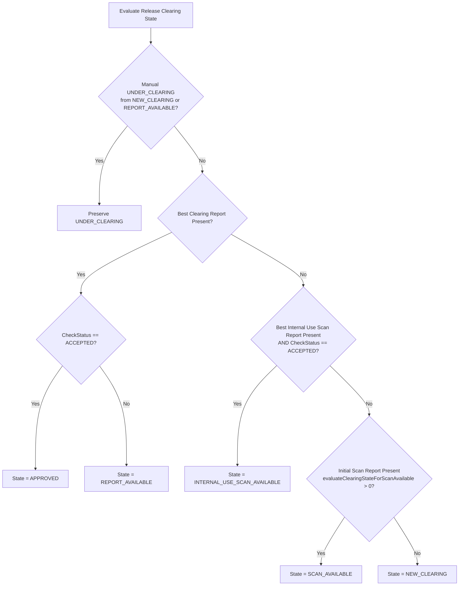

# BR-CLR-001: Release Clearing State Determination & Manual Transitions

> **Standard Classification:** State Machine / Behavioral Invariant & Lifecycle Constraint  
> **Target Entity:** `Release`, `Attachment` (`CLEARING_REPORT`, `INTERNAL_USE_SCAN_REPORT`, `INITIAL_SCAN_REPORT`), Integration Actions (`Send to FOSSology`)  
> **Status:** Approved  
> **Enforcement Points:** Backend Domain Services (`ReleaseService.autosetReleaseClearingState`, `ComponentDatabaseHandler.evaluateClearingStateForScanAvailable`)

---

## 1. Executive Summary & Formal Statements

### 1.1 Formal Statement (RuleSpeak® / EARS)

* **While** updating a `Release`:
  * **If** the user manually sets `clearingState` to `UNDER_CLEARING` **and** the prior `clearingState` is either `NEW_CLEARING` or `REPORT_AVAILABLE`, **then** the system **shall preserve the manual state** and skip automatic recalculation based on attachments.
  * **Otherwise**, the system **shall automatically determine and assign** the `clearingState` according to the following evaluation precedence:
    1. **If** a Clearing Report (`BestClearingReport`) is attached:
      * **If** its `checkStatus` is `ACCEPTED`, **then** `clearingState` shall be `APPROVED`.
      * **Otherwise** (`checkStatus` is not `ACCEPTED`), **then** `clearingState` shall be `REPORT_AVAILABLE`.
    2. **Else if** an Internal Use Scan Report (`BestInternalUseScanReport`) is attached with `checkStatus` equal to `ACCEPTED`, **then** `clearingState` shall be `INTERNAL_USE_SCAN_AVAILABLE`.
    3. **Else if** an Initial Scan Report (`INITIAL_SCAN_REPORT`) is attached (evaluated via `evaluateClearingStateForScanAvailable > 0`), **then** `clearingState` shall be `SCAN_AVAILABLE`.
    4. **Otherwise** (no qualifying scan, internal use, or clearing reports exist), `clearingState` shall default to `NEW_CLEARING`.
* **When** a user triggers the action **"Send to FOSSology"** on a `Release`:
  * **Then** the system **shall transition** the release `clearingState` to `SENT_TO_CLEARING_TOOL`.

### 1.2 Purpose & Risk Mitigated
Automating the `Release` clearing lifecycle based on verified attachment artifacts eliminates human error and status drift, ensuring that releases are never marked `APPROVED` without an accepted clearing report. Allowing an explicit manual transition to `UNDER_CLEARING` from unverified or draft states (`NEW_CLEARING`, `REPORT_AVAILABLE`) enables clearing specialists to explicitly indicate active work on a release, preventing duplicate clearing efforts across distributed teams.

---

## 2. Business Vocabulary & Domain Definitions (SBVR)

| Term | Domain Concept & Meaning | Source Attribute / Field |
|---|---|---|
| **Clearing State** | Current workflow lifecycle status of a release regarding open source license clearing. | `Release.clearingState` |
| **Clearing Report** | Final formal license clearing report document attached to a release. | `AttachmentType.CLEARING_REPORT` |
| **Internal Use Scan Report** | Scan analysis report cleared strictly for internal deployment/use. | `AttachmentType.INTERNAL_USE_SCAN_REPORT` |
| **Initial Scan Report** | Source code scan results/report generated during initial clearing intake. | `AttachmentType.INITIAL_SCAN_REPORT` |
| **Send to FOSSology** | External clearing tool integration action dispatching source code for scanning. | `ReleaseService.sendToFossology` |
| **Check Status** | Verification assessment of an attachment artifact (`ACCEPTED`, `REJECTED`, `PENDING`). | `Attachment.checkStatus` |
| **Manual Override** | User-selected state change to `UNDER_CLEARING` to signal active in-progress clearing. | `Release.setClearingState(UNDER_CLEARING)` |

---

## 3. Detailed Specifications & Behavioral Invariants

### 3.1 Preconditions & Evaluation Precedence

The recalculation hook triggers whenever a `Release` is created, updated, or its attachments collection changes.

### 3.2 State Transition Matrix

| Previous State (`stateBefore`) | Trigger / Action | Attached Artifacts & Status | Resulting State (`stateAfter`) |
|---|---|---|---|
| `NEW_CLEARING` or `REPORT_AVAILABLE` | User manual update | N/A | `UNDER_CLEARING` (Preserved to indicate active work) |
| Any | Action: "Send to FOSSology" | External scan job dispatched | `SENT_TO_CLEARING_TOOL` |
| Any | Attachment added / updated | `CLEARING_REPORT` with `ACCEPTED` | `APPROVED` |
| Any | Attachment added / updated | `CLEARING_REPORT` with `PENDING` / `REJECTED` | `REPORT_AVAILABLE` |
| Any (No Clearing Report) | Attachment added / updated | `INTERNAL_USE_SCAN_REPORT` with `ACCEPTED` | `INTERNAL_USE_SCAN_AVAILABLE` |
| Any (No Clearing / Internal Report) | Attachment added / updated | `INITIAL_SCAN_REPORT` present | `SCAN_AVAILABLE` |
| `APPROVED` or `REPORT_AVAILABLE` | `CLEARING_REPORT` deleted | `INITIAL_SCAN_REPORT` attached | `SCAN_AVAILABLE` |
| `APPROVED` or `REPORT_AVAILABLE` | `CLEARING_REPORT` deleted | `INTERNAL_USE_SCAN_REPORT` (`ACCEPTED`) | `INTERNAL_USE_SCAN_AVAILABLE` |
| `APPROVED` or `REPORT_AVAILABLE` | `CLEARING_REPORT` deleted | No qualifying reports remain | `NEW_CLEARING` |

---

## 4. Executable Acceptance Scenarios (Specification by Example / Gherkin)

### Scenario 1: Manual transition to UNDER_CLEARING to claim release work
* **Given** a release `"lib-parser-1.0"` with clearing state `NEW_CLEARING`
* **When** a clearing specialist manually updates the clearing state to `UNDER_CLEARING`
* **Then** the clearing state remains `UNDER_CLEARING`
* **And** automatic recalculation based on attachments is skipped.

### Scenario 2: Dispatching source code to FOSSology updates state
* **Given** a release `"lib-parser-1.0"` with clearing state `NEW_CLEARING`
* **When** a user clicks "Send to FOSSology"
* **Then** the release clearing state transitions to `SENT_TO_CLEARING_TOOL`.

### Scenario 3: Initial scan report upload sets SCAN_AVAILABLE
* **Given** a release `"lib-parser-1.0"` with clearing state `SENT_TO_CLEARING_TOOL`
* **When** an attachment of type `INITIAL_SCAN_REPORT` is added to the release
* **Then** `evaluateClearingStateForScanAvailable` returns a count greater than 0
* **And** the release clearing state is automatically set to `SCAN_AVAILABLE`.

### Scenario 4: Upload of an ACCEPTED Clearing Report marks release APPROVED
* **Given** a release `"lib-parser-1.0"` with clearing state `SCAN_AVAILABLE`
* **When** a `CLEARING_REPORT` attachment is added with check status `ACCEPTED`
* **Then** the release clearing state is automatically updated to `APPROVED`.

### Scenario 5: Upload of an unapproved Clearing Report sets REPORT_AVAILABLE
* **Given** a release `"lib-parser-1.0"` with clearing state `NEW_CLEARING`
* **When** a `CLEARING_REPORT` attachment is added with check status `PENDING`
* **Then** the release clearing state is automatically updated to `REPORT_AVAILABLE`.

### Scenario 6: Upload of an ACCEPTED Internal Use Scan Report without Clearing Report
* **Given** a release `"lib-parser-1.0"` with clearing state `SCAN_AVAILABLE`
* **And** no `CLEARING_REPORT` is attached
* **When** an `INTERNAL_USE_SCAN_REPORT` attachment is added with check status `ACCEPTED`
* **Then** the release clearing state is automatically updated to `INTERNAL_USE_SCAN_AVAILABLE`.

### Scenario 7: Deletion of Clearing Report cascades back to Initial Scan Report
* **Given** a release `"lib-parser-1.0"` with clearing state `APPROVED`
* **And** it has both an accepted `CLEARING_REPORT` and an `INITIAL_SCAN_REPORT`
* **When** the `CLEARING_REPORT` attachment is deleted from the release
* **Then** the release clearing state is recalculated and set to `SCAN_AVAILABLE`.

---

## 5. Implementation & Traceability

- **Backend Enforcement:** `org.eclipse.sw360.datahandler.thrift.releases.ReleaseService.autosetReleaseClearingState(Release releaseAfter, Release releaseBefore)`
- **Scan Evaluation Handler:** `org.eclipse.sw360.datahandler.db.ComponentDatabaseHandler.evaluateClearingStateForScanAvailable(Release release)`
- **Helper Evaluation Methods:**
  - `getBestClearingReport(Release release)`
  - `getBestInternalUseScanReport(Release release)`
- **FOSSology Integration Service:** `org.eclipse.sw360.fossology.FossologyService`
- **Data Model:** `org.eclipse.sw360.datahandler.thrift.components.ClearingState`
- **Unit / Integration Tests:** `org.eclipse.sw360.datahandler.thrift.releases.ReleaseServiceTest`

---

## 6. Revision History

| Version | Date | Author | Description |
|---|---|---|---|
| 1.0 | 2026-09-07 | Gaurav Mishra | Initial specification of automatic release clearing state calculation hierarchy |
