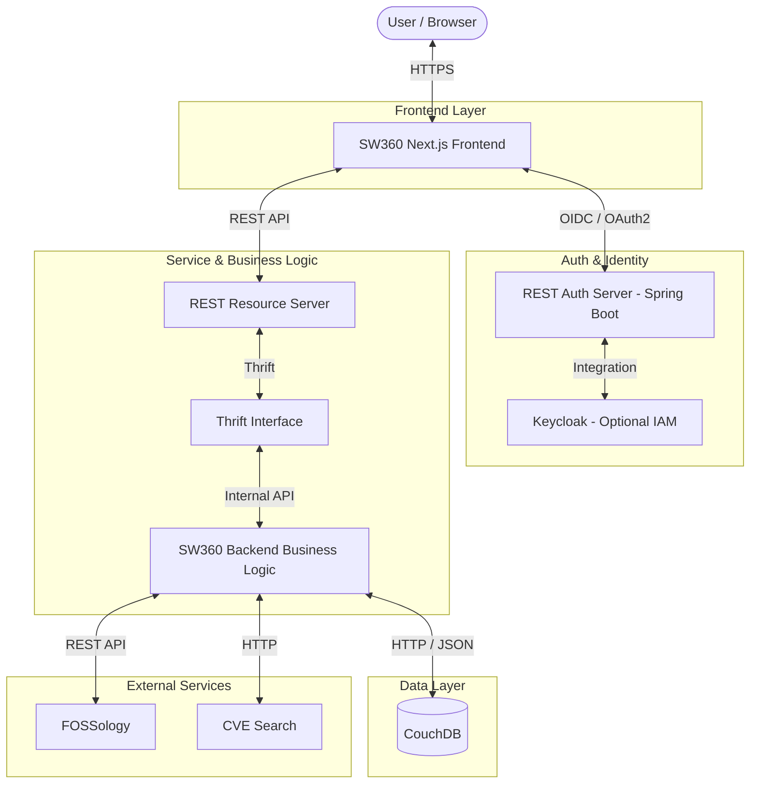

# SW360 Architecture Documentation

This document describes the high-level architecture of the SW360 project, its
major components, and how they interact.

## System Overview

SW360 is a web-based application designed to manage software components,
licenses, and security vulnerabilities. It follows a multi-tier architecture
consisting of a React-based frontend, a Spring Boot-based REST API
(Authorization and Resource Servers), a Thrift-based backend service layer, and
a CouchDB database. Integration with Keycloak is supported for enterprise-grade
Identity and Access Management.

## Component Diagram

## Major Components

### 1. SW360 Frontend
A modern web application built with **Next.js** and **React**. It provides the
user interface for managing projects, releases, components, and licenses. It
communicates with the backend via REST APIs and uses **Keycloak** for single
sign-on (SSO).

### 2. SW360 REST Services
Spring Boot applications that provide the API surface:
- **Authorization Server**: The core identity provider based on Spring Security,
  managing authentication flows and token issuance.
- **Resource Server**: Handles data-related REST requests from the frontend.

### 3. Keycloak (Alternative/Integrated IAM)
An optional Identity and Access Management solution that can be integrated with
the Authorization Server for advanced user management and SSO features.

### 4. CouchDB
The primary NoSQL database used to store software component details, project
information, and moderation requests.

### 5. Backend Service Layer
The core business logic of SW360:
- **Thrift Interface**: Serves as the communication bridge between the REST
  layer and the business logic.
- **SW360 Backend**: Implements the technical business logic, complex
  relationships between records, and manages data persistence.

## Deployment Architecture

SW360 is traditionally deployed on **Apache Tomcat** application servers.
- **Webapps**: Each major backend module (Resource Server, Authorization Server,
  and Backend) is packaged as a `.war` file and deployed as a separate web
  application within the Tomcat container.
- **Scalability**: This modular deployment allows for independent scaling of the
  REST layer and the core backend service.

## Security Architecture

- **Authentication**: Delegated to Keycloak via OpenID Connect (OIDC).
- **Authorization**: Role-based access control (RBAC) enforced at the REST
  layer.
- **Communication**: All external communication is encrypted via TLS (HTTPS).
- **Data Integrity**: Handled through validation logic in the backend service
  layer.

## Integration Points

- **FOSSology**: Integrated for license scanning and analysis.
- **CVE Search**: Used to fetch and display security vulnerabilities associated
  with components.
