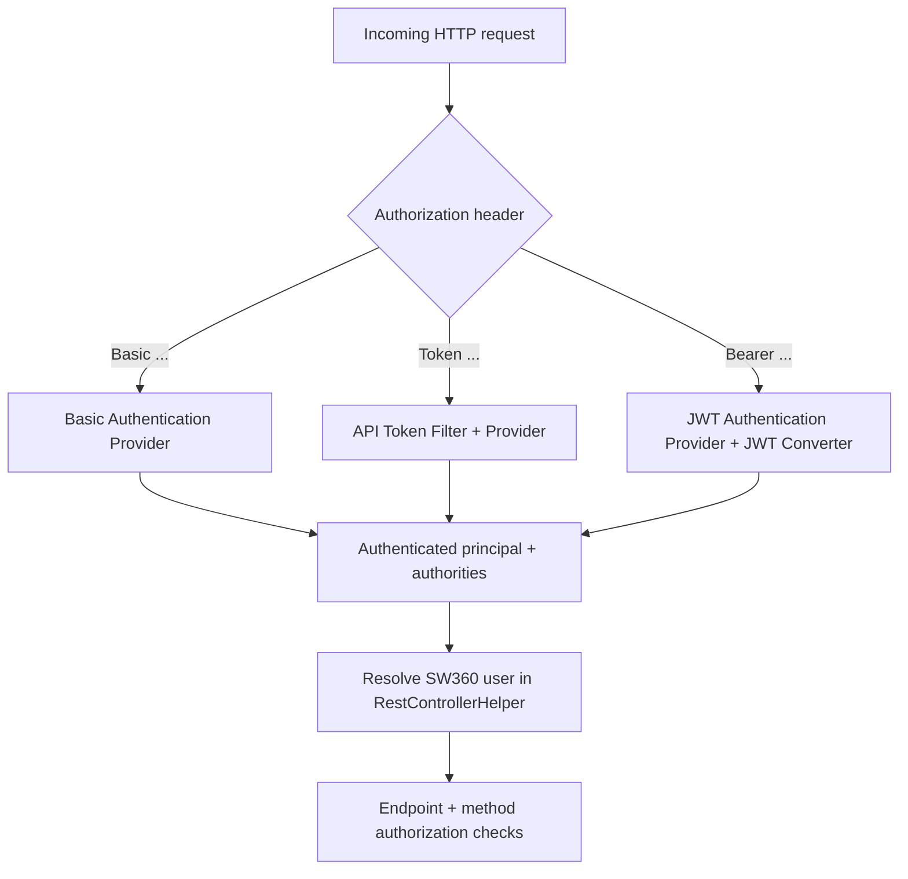
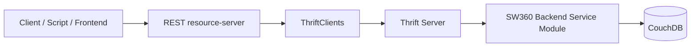

The sw360 REST API provides access to sw360 resources for external clients. It consists currently of three Maven modules aggregated in one parent module `rest` in the sw360 distribution.

> For access setup and request examples, see [API Access]().
> Legacy workflows are kept in [Legacy REST API Guides]().

## Resource Server Authentication and Authorization Flow

This section describes how `resource-server` identifies the principal and
evaluates effective permissions.

### Security Pipeline (High-Level)



### How principal identity is resolved

`RestControllerHelper.getSw360UserFromAuthentication()` resolves the SW360 user
from authentication context using this order:

1. Cached `User` in authentication details (fast path).
2. JWT claims (`email`, fallback `mapped_user_email`, `user_name`) depending on
   token style.
3. Basic-auth principal (`Sw360UserDetails` or username string).

If the user cannot be resolved, the request fails with authentication error.

### How roles and scopes become authorities

The resource server merges:

- **User group authorities** (for example `READ`, `WRITE`, `ADMIN`) based on the
  SW360 user group configuration.
- **Token capability authorities** (`TOKEN_READ`, `TOKEN_WRITE`) based on token
  scope/capability metadata.

Scope mapping behavior:

- `READ` (or `SCOPE_READ`) => `TOKEN_READ`
- `WRITE` (or `SCOPE_WRITE`) => `TOKEN_READ` + `TOKEN_WRITE`
- Missing/unknown scope defaults to read/write capabilities for compatibility.

### Endpoint capability checks

HTTP method checks apply to `/api/**`:

- `GET` requires `TOKEN_READ`
- `POST`, `PUT`, `PATCH`, `DELETE` require `TOKEN_WRITE`

These checks are evaluated in addition to controller/service-level security.

## Module Structure

The `rest` module provides a REST API infrastructure for sw360 including:
* Module `authorization-server` - OAuth2/OIDC authorization server that authenticates SW360 users and issues JWT access tokens.
* Module `resource-server` - REST API gateway that validates credentials/tokens and exposes SW360 resources.
* Module `rest-common` - shared support library code used by both REST applications.

The REST API implementation uses:
* Module `authorization-server` stores OAuth client registrations in CouchDB database `sw360oauthclients` and authenticates users against SW360 user data from `sw360users` through the backend user service.
* Module `resource-server` uses Thrift clients to reach the respective SW360 backend services and serialize the resulting data as REST/HAL responses.

## Request Flow from Client to Backend Service



## API Principles

### Security Principles

The `resource-server` supports multiple authentication mechanisms and uses a
single capability model (`TOKEN_READ` / `TOKEN_WRITE`) for endpoint protection.
Tokens are validated, converted to authorities, merged with user-group
authorities, and then evaluated against endpoint and method-level rules.

For user-facing setup details of each mechanism, see
[API Access]().

### Data Principles

The REST API provides Hypermedia using [HAL](https://stateless.co/hal_specification.html) (Hypertext Application Language).
The following abbreviated example shows the root HAL response shape:

```
curl -u '<sw360-user>:<password>' 'https://<my_sw360_server>/resource/api'
```

```json
{
  "_links": {
    "sw360:attachmentCleanUp": {
      "href": "http://localhost:8080/resource/api/attachmentCleanUp"
    },
    "sw360:fossology": {
      "href": "http://localhost:8080/resource/api/fossology"
    },
    "sw360:attachments": {
      "href": "http://localhost:8080/resource/api/attachments{?sha1}",
      "templated": true
    },
    "sw360:cacheAdmin": {
      "href": "http://localhost:8080/resource/api/admin/cache"
    },
    "sw360:changeLogs": {
      "href": "http://localhost:8080/resource/api/changelog/document/{id}",
      "templated": true
    },
    "sw360:clearingRequests": {
      "href": "http://localhost:8080/resource/api/clearingrequest"
    },
    "sw360:components": {
      "href": "http://localhost:8080/resource/api/components"
    },
    "sw360:configurations": {
      "href": "http://localhost:8080/resource/api/configurations"
    },
    "sw360:databaseSanitation": {
      "href": "http://localhost:8080/resource/api/databaseSanitation"
    },
    "sw360:department": {
      "href": "http://localhost:8080/resource/api/departments"
    },
    "sw360:ecc": {
      "href": "http://localhost:8080/resource/api/ecc"
    },
    "sw360:importExport": {
      "href": "http://localhost:8080/resource/api/importExport"
    },
    "sw360:licenses": {
      "href": "http://localhost:8080/resource/api/licenses"
    },
    "sw360:licenseinfo": {
      "href": "http://localhost:8080/resource/api/licenseinfo"
    },
    "sw360:moderationRequests": {
      "href": "http://localhost:8080/resource/api/moderationrequest"
    },
    "sw360:obligations": {
      "href": "http://localhost:8080/resource/api/obligations"
    },
    "sw360:packages": {
      "href": "http://localhost:8080/resource/api/packages"
    },
    "sw360:projects": {
      "href": "http://localhost:8080/resource/api/projects"
    },
    "sw360:releases": {
      "href": "http://localhost:8080/resource/api/releases"
    },
    "sw360:reports": {
      "href": "http://localhost:8080/resource/api/reports"
    },
    "sw360:schedule": {
      "href": "http://localhost:8080/resource/api/schedule"
    },
    "sw360:searches": {
      "href": "http://localhost:8080/resource/api/search"
    },
    "sw360:users": {
      "href": "http://localhost:8080/resource/api/users"
    },
    "sw360:vendors": {
      "href": "http://localhost:8080/resource/api/vendors"
    },
    "sw360:vulnerabilities": {
      "href": "http://localhost:8080/resource/api/vulnerabilities"
    },
    "profile": {
      "href": "http://localhost:8080/resource/api/profile"
    },
    "curies": [
      {
        "href": "http://localhost:8080/resource/docs/{rel}.html",
        "name": "sw360",
        "templated": true
      }
    ]
  }
}
```

## API Installation

Both, the `authorization-server` and the `resource-server` can be build using Maven like the rest of the project. Each is generating a Spring Boot server that can be deployed in an application container, e.g. Tomcat.

## API Configuration

Since the `authorization-server` and the `resource-server` are Spring Boot servers, they are configured as usual via `/src/main/resources/application.yml`. In addition some configuration comes historically from `sw360.properties`. Please note that all configurations could be provided centrally in the `/etc/sw360/` directory. As such, the `sw360.properties` sits directly in `/etc/sw360/`. For rest-specific configurations the application considers the location `/etc/sw360/rest`.

### Authorization Server Configuration

The authorization server is responsible for:

- authenticating SW360 users against the SW360 user data set (`sw360users`)
- storing OAuth client registrations in CouchDB database `sw360oauthclients`
- issuing JWT access tokens and refresh tokens
- exposing OIDC/JWKS metadata used by clients and the resource server

#### Authorization Server `application.yml`

| Property | Description | Example / Default |
| --- | --- | --- |
| `couchdb.url` | CouchDB base URL used for OAuth client storage | `http://localhost:5984` |
| `couchdb.database` | OAuth client database | `sw360oauthclients` |
| `couchdb.username` | CouchDB username for OAuth client database | `sw360` |
| `couchdb.password` | CouchDB password for OAuth client database | `sw360fossie` |
| `sw360.cors.allowed-origin` | Allowed CORS origin | environment-specific |
| `security.oauth2.resource.id` | Resource identifier embedded into issued tokens | `sw360-REST-API` |
| `security.accesstoken.validity` | Access token validity | `30` |

#### Authorization Server shared `sw360.properties`

| Property | Description | Default |
| --- | --- | --- |
| `rest.write.access.usergroup` | Minimum SW360 user group that gets write authority | `SW360_ADMIN` |
| `rest.admin.access.usergroup` | Minimum SW360 user group that gets admin authority for client management | `SW360_ADMIN` |

### <a name="general-config"></a>General Configuration

Shared properties commonly used by the REST applications:

| Property | Description | Default |
| --- | --- | --- |
| `backend.url` | URL where backend/thrift services can be reached | `http://127.0.0.1:8080` |
| `rest.write.access.usergroup` | Minimum user group that should receive write authority | `SW360_ADMIN` |
| `rest.admin.access.usergroup` | Minimum user group that should receive admin authority | `SW360_ADMIN` |

After this configuration is done the normal REST service for client management should be usable. This one is only accessible for authenticated users that get the `ADMIN` authority (remember, the therefore necessary sw360 usergroup has just been configured). So the clients can be configured now.

## Client Management

In the scenarios of this page, the shipped authorization server is used. So the next step is to configure a valid OAuth2 client in this authorization server. There should be one OAuth2 client per external REST API client (which in turn can have many different users). Therefore the authorization server offers a REST API for basic CRUD operations for configuring the clients that are stored in the just configured CouchDB. Since sw360-`ADMIN` privileges are needed for client management, an authentication is needed to work with this API.

### Client Management via Curl

The client-management API can be used directly via curl:

```bash
SW360_USER=[admin sw360 user]
SW360_PW=[corresponding sw360 admin user password]
curl -s -S \
     --user "${SW360_USER}:${SW360_PW}" \
     --header "Content-Type: application/json" \
     --header "Accept: application/json" \
     -X POST https://[hostname]:[port]/authorization/client-management \
     -d @- <<EOF
{
    "description" : "my first test client",
    "authorities" : [ "BASIC" ],
    "scope" : [ "READ" ],
    "access_token_validity" : 3600,
    "refresh_token_validity" : 3600
}
EOF
```

Live response format from local server (`POST /authorization/client-management`):

```json
{
  "access_token_validity": 3600,
  "authorities": [
    "BASIC"
  ],
  "client_id": "<generated-client-id>",
  "client_secret": "<hashed-client-secret>",
  "description": "my first test client",
  "refresh_token_validity": 3600,
  "scope": [
    "READ"
  ]
}
```

## OAuth2 Access Token

With a configured OAuth client it is possible to retrieve an access token for
the REST API from the authorization server.

Current token endpoint metadata can be discovered from:

```bash
curl -sS 'https://<my_sw360_server>/authorization/.well-known/oauth-authorization-server'
```

Live local discovery response includes:

```json
{
  "issuer": "http://localhost:8080/authorization",
  "token_endpoint": "http://localhost:8080/authorization/oauth2/token",
  "jwks_uri": "http://localhost:8080/authorization/oauth2/jwks",
  "grant_types_supported": [
    "authorization_code",
    "client_credentials",
    "refresh_token",
    "urn:ietf:params:oauth:grant-type:token-exchange"
  ]
}
```

Example token request (client credentials):

```Bash
curl -X POST \
  --user '[clientid]:[clientsecret]' \
  -d 'grant_type=client_credentials&scope=READ' \
  'https://<my_sw360_server>/authorization/oauth2/token'
```

Live response format from local server:

```json
{
  "access_token": "<jwt-access-token>",
  "scope": "READ",
  "token_type": "Bearer",
  "expires_in": 299
}
```

The `access_token` is then sent to `resource-server` as `Authorization: Bearer <token>`.

### Keycloak Access Token (Client Credentials)

Keycloak OIDC metadata can be discovered with:

```bash
curl -sS 'https://<keycloak-host>/realms/<realm>/.well-known/openid-configuration'
```

Live local discovery response includes:

```json
{
  "issuer": "http://localhost:8083/realms/sw360",
  "token_endpoint": "http://localhost:8083/realms/sw360/protocol/openid-connect/token",
  "jwks_uri": "http://localhost:8083/realms/sw360/protocol/openid-connect/certs"
}
```

Token request template:

```bash
curl -X POST 'https://<keycloak-host>/realms/<realm>/protocol/openid-connect/token' \
  -H 'Content-Type: application/x-www-form-urlencoded' \
  --data 'grant_type=client_credentials&client_id=<client-id>&client_secret=<client-secret>&scope=openid email READ WRITE'
```

Live success response format (local Keycloak):

```json
{
  "access_token": "<jwt-access-token>",
  "expires_in": 3600,
  "refresh_expires_in": 0,
  "token_type": "Bearer",
  "not-before-policy": 0,
  "scope": "email READ WRITE profile"
}
```

More Links:

* OAuth2 more information: https://oauth.net/2/
* Decode Bearer tokens at: https://jwt.io/

## OAuth2 Refresh Token

The authorization server supports so called refresh tokens to generate new access tokens after they have been expired. New access tokens can be generated with the use of the `refresh_token` without further re-authorization of the user. The following url must be used:
```
  https://<my_sw360_server>/authorization/oauth2/token?grant_type=refresh_token&refresh_token=<REFRESH_TOKEN>
```
The client must pass its credentials via basic authentication. Though a user authentication is not necessary.

## Resource Server Configuration

Now that access tokens can be generated, the resource server has to be configured.

#### Resource Server `application.yml`

| Property | Description | Example / Default |
| --- | --- | --- |
| `spring.security.oauth2.resourceserver.jwt.issuer-uri` | OAuth issuer URI | `https://<my_sw360_server>/authorization` |
| `jwt.auth.converter.principle-attribute` | JWT claim used as principal name | `email` |
| `sw360.thrift-server-url` | Backend/thrift server URL | `https://<my_sw360_server>` |
| `sw360.base-url` | Base URL used for generated HAL links (`SW360_BASE_URL` env var) | `https://<my_sw360_server>` |
| `sw360.couchdb-url` | CouchDB URL used for attachments and related services | `https://<couchdb-host>:5984` |
| `sw360.cors.allowed-origin` | Allowed CORS origin | environment-specific |

#### Resource Server `sw360.properties`

| Property | Description | Default |
| --- | --- | --- |
| `rest.apitoken.write.generator.enable` | Enables write-token generation | `true` |
| `rest.apitoken.read.validity.days` | Default/maximum read-token validity | `90` |
| `rest.apitoken.write.validity.days` | Default/maximum write-token validity | `30` |
| `rest.apitoken.hash.salt` | Salt used for API token hashing | implementation default |

The REST API is now completely usable via an own client or testwise with integrated tools.

## Tools

Swagger UI is available on deployed instances for interactive API exploration.
The typical URL is:

```
https://<my_sw360_server>/resource/swagger-ui/index.html
```


When using other tools, set the `Authorization` header according to the chosen
mechanism:

- `Authorization: Basic <base64(user:password)>`
- `Authorization: Token <api-token>`
- `Authorization: Bearer <access-token>`

## Example - Get a project

Here is an example how to query for a project as HTTP GET Request. As for the
resource endpoint, the request:
```
https://sw360.org/resource/api/projects/{id} (or /resource/api/projects/{id})
```
will return the following response:


## API Documentation

sw360 deploys a REST API documentation at every instance. There are the following URLs offered at each instance

| URL | Description |
| --- | --- |
| https://[hostname]:[port]/resource/docs/index.html | Small overview page |
| https://[hostname]:[port]/resource/docs/api-guide.html | The API description for the currently running server |
| https://[hostname]:[port]/resource/swagger-ui/index.html | Swagger UI for interactive API usage |

## Generated Link Base URL

### Original issue (why this needed a fix)

In reverse-proxy deployments, clients often access SW360 via HTTPS while the
application container runs with local HTTP defaults. In that situation, HAL
responses could expose internal/non-canonical links.

Example of the mismatch:

```text
Request URL seen by client:
https://sw360.example.com/resource/api/projects

HAL link returned by server:
"href": "http://localhost:8080/resource/api/projects/065f3aa45c2683297fd1bb39296f519d"
```

This is problematic for clients because links are generated with the wrong
scheme/host, and they do not match the public API origin.

### Previous workaround and why it was changed

Historically, this was often mitigated with reverse-proxy `X-Forward-*` headers
so the app could infer external scheme/port. That approach is operationally
fragile and security-sensitive because it depends on trusted header handling
across proxy boundaries. If a malicious actor injected header values, it could
generate emails with links to arbitrary hosts and was detected as a security
vulnerability in the past and fixed via PR
[#3726](https://github.com/eclipse-sw360/sw360/pull/3726).

### Current solution

Configure the canonical SW360 base URL in `resource-server` `application.yml`
via `sw360.base-url`.

`sw360.base-url` reads the environment variable `SW360_BASE_URL`:

```yaml
sw360:
  base-url: ${SW360_BASE_URL:http://localhost:8080}
```

For HTTPS deployments, set `SW360_BASE_URL` to the externally reachable HTTPS
origin (for example `https://<my_sw360_server>`). Generated HAL links then use
the configured base URL consistently.
