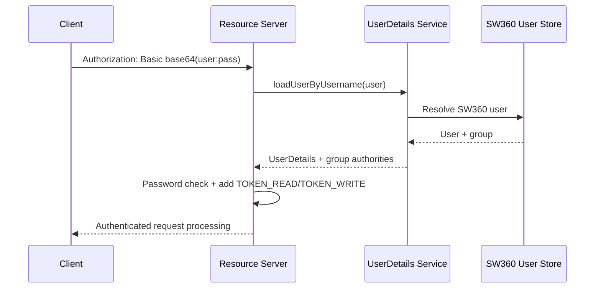
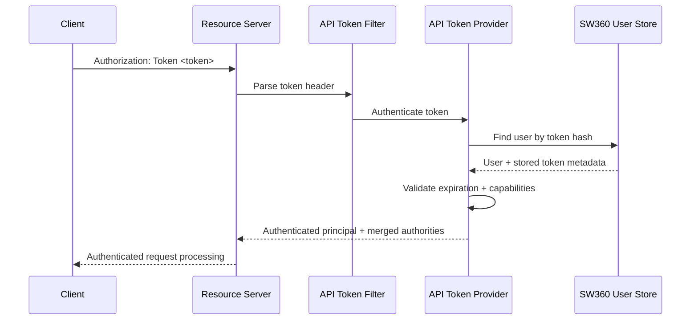
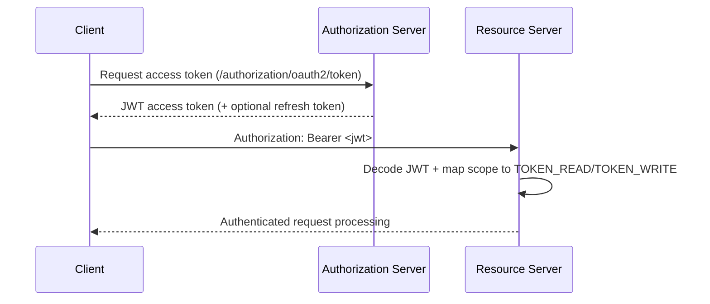
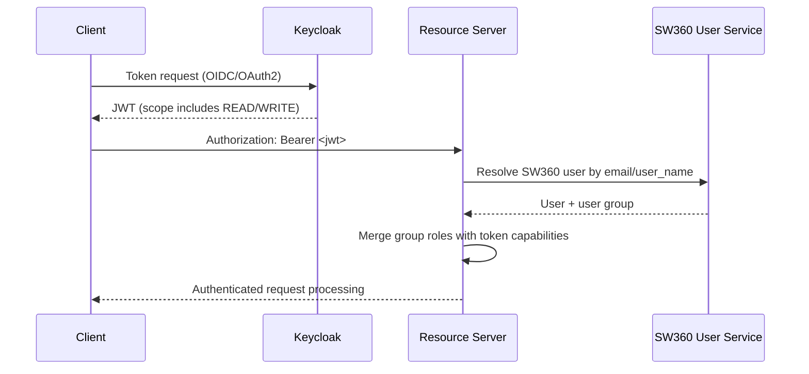

This page describes the current SW360 REST API authentication options and the
runtime authorization behavior in the `resource-server`.

## Authentication Mechanisms (Current)

SW360 supports four mechanisms for REST API access:

| Mechanism | Header / Credential | Typical Use |
| --- | --- | --- |
| Basic Auth | `Authorization: Basic <base64(user:password)>` | Human/admin tools and simple scripts |
| API Token | `Authorization: Token <api-token>` | Long-lived personal or service integration |
| OAuth2 Authorization Server | `Authorization: Bearer <jwt>` | OAuth client flow with `/authorization/oauth2/token` |
| Keycloak | `Authorization: Bearer <jwt>` | OIDC/OAuth2 from external IAM |

## Authorization Model in `resource-server`

- `GET /api/**` requires `TOKEN_READ`.
- `POST`, `PUT`, `PATCH`, `DELETE /api/**` require `TOKEN_WRITE`.
- Common read-only endpoints such as `/health`, `/version`, and report download
  can be exposed separately from the write-protected resource endpoints.

SW360 merges user group authorities (for example `READ`, `WRITE`, `ADMIN`) with
token capability authorities (`TOKEN_READ`, `TOKEN_WRITE`) before endpoint checks.

## JWT Validation

Bearer JWTs used with the REST API are validated in two layers:

This applies to Bearer tokens issued either by the SW360 `authorization-server`
or by Keycloak.

1. **Spring Security resource-server validation** using
   `spring.security.oauth2.resourceserver.jwt.issuer-uri` and
   `spring.security.oauth2.resourceserver.jwt.jwk-set-uri` from
   `resource-server` `application.yml`.
2. **SW360 JWKS validation mode** when `jwks.validation.enabled=true` in
   `sw360.properties`. In this path SW360 validates:
   - token signature against `jwks.endpoint.url`
   - expected issuer from `jwks.issuer.url`
   - required time claims such as expiration and issued-at
   - optional audience (`aud`) from `jwt.claim.aud`

If `jwt.claim.aud` is empty, audience validation is skipped. Scope values are
then translated into `TOKEN_READ` and `TOKEN_WRITE` capabilities.

## 1) Basic Authentication

Basic auth authenticates SW360 user credentials and assigns both
`TOKEN_READ` and `TOKEN_WRITE` capabilities after successful login.



Example:

```bash
curl -X GET \
  -H "Authorization: Basic <BASE64_USER_PASSWORD>" \
  "https://<my_sw360_server>/resource/api/projects"
```

## 2) API Token (Read or Read/Write)

API tokens are user-owned tokens generated through REST API user endpoints. The
token carries capability authorities (`READ` or `READ+WRITE`) that are mapped to
`TOKEN_READ`/`TOKEN_WRITE` and merged with user group roles.



Token management endpoints:

- `GET /api/users/tokens`
- `POST /api/users/tokens`
- `DELETE /api/users/tokens?name=<token-name>`

Example:

```bash
curl -X GET \
  -H "Authorization: Token <API_TOKEN>" \
  "https://<my_sw360_server>/resource/api/projects"
```

## 3) OAuth2 via SW360 Authorization Server

In this flow, the client obtains a JWT from SW360 `authorization-server` and
calls `resource-server` with `Bearer` token.



Example token request:

```bash
curl -X POST \
  --user '<client-id>:<client-secret>' \
  -d 'grant_type=client_credentials&scope=READ' \
  'https://<my_sw360_server>/authorization/oauth2/token'
```

Example API request:

```bash
curl -X GET \
  -H "Authorization: Bearer <ACCESS_TOKEN>" \
  "https://<my_sw360_server>/resource/api/projects"
```

## 4) Keycloak (OIDC/OAuth2)

In Keycloak mode, clients obtain JWTs from Keycloak and call SW360 resource
endpoints with `Bearer` token. Scope values are interpreted as capabilities:

- `READ` => `TOKEN_READ`
- `WRITE` => `TOKEN_READ` + `TOKEN_WRITE`



For Keycloak setup and realm/client automation, see
[Keycloak Authentication]().

## Legacy Guide

Older and historical workflows were moved to:

- [Legacy REST API Access Guide]()

